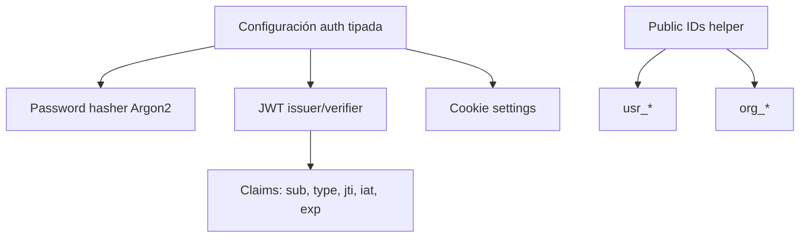
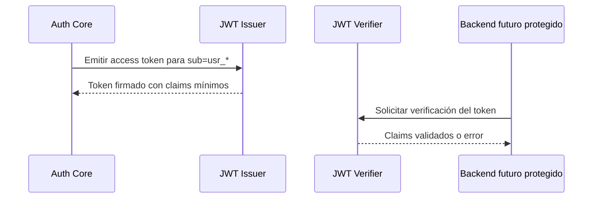

# feature/BACK-AUTH-OAUTH2-002-auth-core

## Objetivo

Documentar la implementación de `BACK-AUTH-OAUTH2-002 — Auth Core` tras QA aprobado.

El objetivo técnico de la rama ha sido incorporar el núcleo base de autenticación del backend sin exponer todavía endpoints ni routers.

## Cambios realizados

- Configuración de autenticación tipada.
- Hashing y verificación de contraseñas mediante `pwdlib[argon2]`.
- Emisor y verificador JWT mínimo para access tokens.
- Claims JWT mínimos: `sub`, `type=access`, `jti`, `iat`, `exp`.
- Value object para configuración de cookies.
- Helper para identificadores públicos con prefijos `usr_` y `org_`.
- Tests unitarios para el Auth Core.

No se han implementado endpoints, routers, login, register, CORS ni CSRF en esta tarea.

### Diagrama de componentes



### Ejemplos

Claims JWT esperados:

```json
{
  "sub": "usr_01HZXAMPLEUSERID0000000000",
  "type": "access",
  "jti": "01HZXAMPLETOKENID0000000000",
  "iat": 1760000000,
  "exp": 1760000900
}
```

Cookie settings de ejemplo:

```json
{
  "httponly": true,
  "secure": true,
  "samesite": "lax",
  "path": "/"
}
```

Public IDs de ejemplo:

```text
usr_01HZXAMPLEUSERID0000000000
org_01HZXAMPLEORGID00000000000
```

## Justificacion tecnica

El Auth Core se ha separado de los endpoints para disponer primero de primitivas reutilizables, testeables y desacopladas. Esta separación permite validar el comportamiento crítico de seguridad antes de conectarlo a flujos HTTP.

El uso de `pwdlib[argon2]` aporta hashing moderno para contraseñas. La emisión JWT mínima define un contrato claro para access tokens sin introducir todavía complejidad de sesiones, refresh tokens o revocación.

## Decisiones tomadas

- Mantener el alcance sin endpoints ni routers para reducir superficie de exposición durante esta tarea.
- Usar claims JWT mínimos y explícitos para tokens de acceso.
- Modelar cookies como value object antes de utilizarlas en respuestas HTTP.
- Usar prefijos `usr_` y `org_` para diferenciar identificadores públicos por tipo de entidad.
- No incluir secretos reales en documentación ni ejemplos.

## Tests ejecutados

- `make backend-quality` ✅
- `make backend-test-unit` ✅ (`291 passed, 56 deselected`)

No consta la ejecución de otros tests en el contexto recibido.

## Riesgos o deuda tecnica

- Pendiente implementar endpoints de autenticación y su integración con FastAPI.
- Pendiente definir el flujo completo de login/register si aplica en siguientes tareas.
- Pendiente integrar autenticación con RBAC, tenant context y auditoría.
- Pendiente definir política completa de sesiones, expiración, revocación y rotación de secretos.
- Las cookies están preparadas como configuración, pero todavía no se usan en respuestas HTTP.

## Relacion con el backend

La rama afecta directamente al backend porque crea las primitivas internas sobre las que se construirán autenticación, autorización y protección de rutas. Es una base necesaria para aplicar validación server-side, evitar lógica crítica en frontend y preparar flujos seguros alineados con el modelo multi-tenant de Project Guakamole.

### Secuencia conceptual de token


