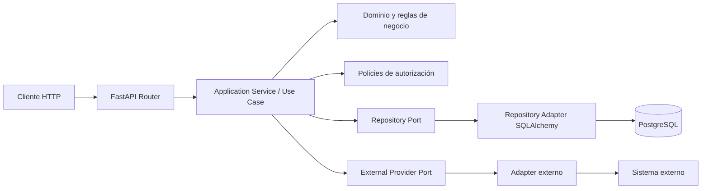
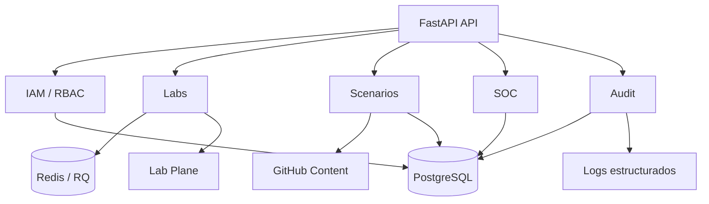
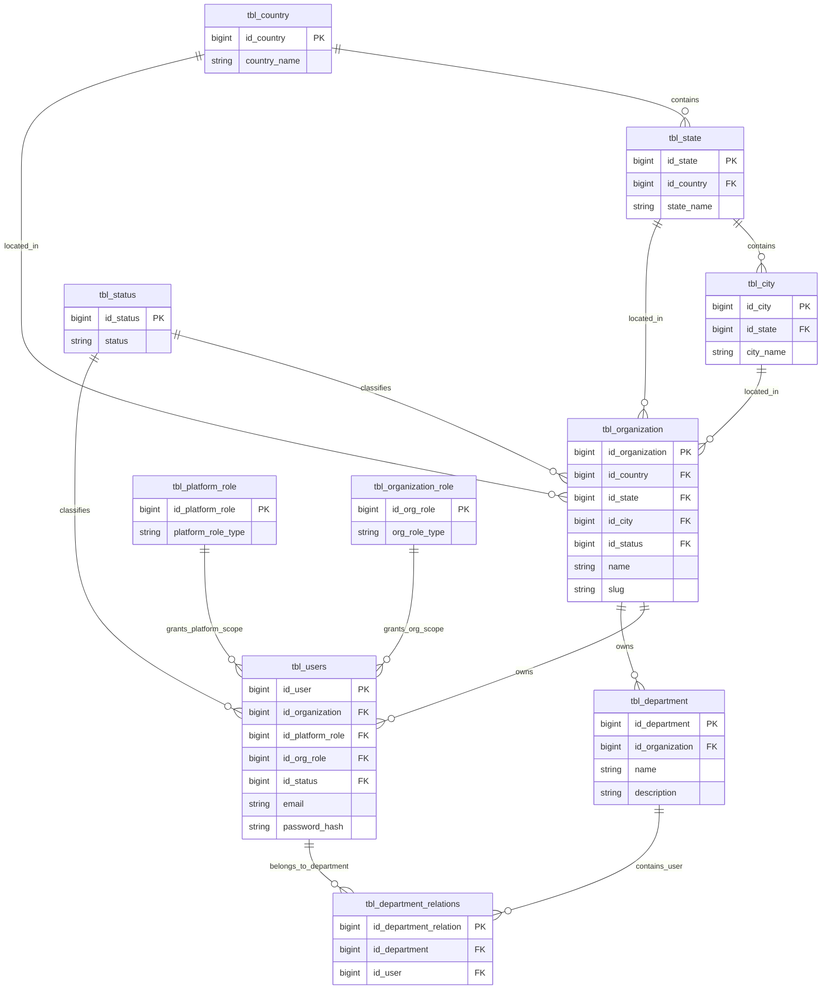
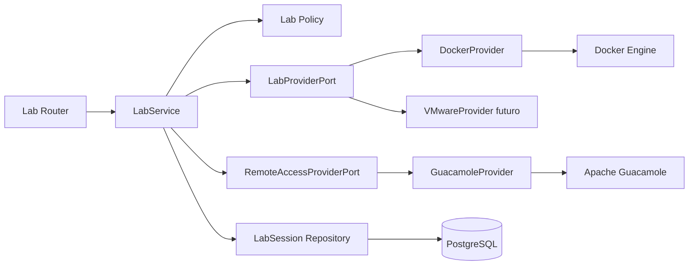
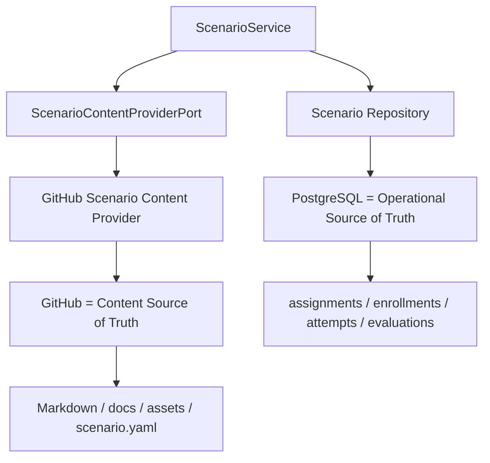
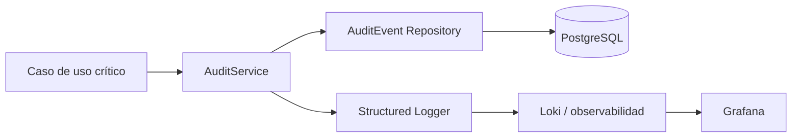
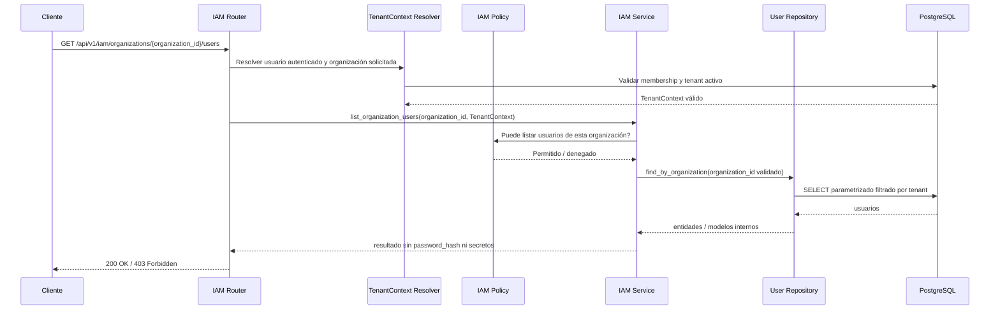

# DOC-BACK-ARCH-HEX-001 — Arquitectura hexagonal pragmática security-first para backend

**Estado:** Documento educativo inicial / fase documental.

Este documento explica cómo queremos orientar la arquitectura del backend de Project Guakamole antes de seguir creciendo con nuevos endpoints de IAM, RBAC, Labs, Scenarios, SOC y Audit.

> Importante: esta fase **solo planifica y documenta**. No implementa todavía la arquitectura. La implantación real deberá abordarse en la fase futura `BACK-ARCH-HEX-001`.

## Qué es la arquitectura hexagonal

La arquitectura hexagonal, también conocida como **ports & adapters**, es una forma de organizar el backend para que el núcleo de negocio no dependa directamente de FastAPI, PostgreSQL, Docker, Guacamole, GitHub o cualquier otra herramienta externa.

Dicho de forma coloquial:

- el centro de la aplicación contiene las reglas importantes;
- alrededor hay puertas de entrada y salida;
- FastAPI entra por una puerta;
- PostgreSQL, Docker, Guacamole o GitHub salen por otras puertas;
- si mañana cambiamos una herramienta, no deberíamos romper todo el dominio.

Un endpoint no debería ser el sitio donde se decide todo. El endpoint recibe la petición, valida formato básico, llama a un caso de uso y devuelve una respuesta. Las decisiones relevantes viven en servicios, policies, repositorios y adapters.

## Qué NO es

La arquitectura hexagonal no es magia.

- No sustituye controles de seguridad.
- No impide por sí sola SQL injection, IDOR o Broken Access Control.
- No obliga a crear diez capas para cada operación sencilla.
- No significa abstraer todo desde el primer día.
- No convierte un mal diseño de permisos en un buen diseño.
- No elimina la necesidad de tests.

Para Guakamole buscamos una versión **pragmática**, no una arquitectura académica imposible de mantener por un equipo junior.

## Por qué se escoge para Guakamole

Guakamole no es solo una API CRUD. El backend tiene que coordinar:

- identidad, usuarios, organizaciones y roles;
- aislamiento multiempresa;
- asignaciones de roadmaps y escenarios;
- sesiones temporales de laboratorio;
- integración futura con Docker, VMware y Guacamole;
- contenido de escenarios en GitHub;
- persistencia operacional en PostgreSQL;
- auditoría y logs estructurados.

Si toda esa lógica acaba dentro de routers de FastAPI, el backend será difícil de revisar, testear y securizar. La arquitectura hexagonal nos ayuda a separar responsabilidades y a mantener un monolito modular sostenible.

## Por qué aplicarla ahora

La decisión se toma antes de implementar más endpoints de IAM/RBAC/Labs porque esas áreas son críticas para seguridad.

Ahora estamos a tiempo de fijar reglas:

- cómo entra una request;
- dónde se valida autorización;
- dónde se resuelve el `TenantContext`;
- dónde se consulta PostgreSQL;
- dónde se integran proveedores externos;
- cómo se testean casos de uso sin levantar toda la infraestructura.

Si esperamos a tener muchos endpoints mezclando negocio, queries y permisos, migrar será más caro y más arriesgado.

## Beneficios actuales

### Separación routers / services / repositories / policies

Cada pieza tiene una responsabilidad clara:

- `router`: entrada HTTP;
- `service`: caso de uso;
- `policy`: autorización;
- `repository`: acceso a datos;
- `schema`: entrada y salida de API.

### Reducción de lógica en endpoints

El router no debe decidir reglas de negocio ni permisos complejos. Eso hace que el endpoint sea más corto, revisable y fácil de proteger.

### Validación server-side

Las validaciones importantes se hacen en backend, no en el frontend. El frontend ayuda a la experiencia de usuario, pero no es una frontera de seguridad.

### RBAC centralizado

Los permisos no deben quedar repartidos en condiciones sueltas por cada endpoint. Las policies deben concentrar decisiones como:

- quién puede listar usuarios de una organización;
- quién puede gestionar grupos;
- quién puede ver intentos, Case Reports o resultados.

### TenantContext

Cada request debe resolverse dentro de un contexto de tenant validado contra la identidad autenticada. No se debe confiar en un `organization_id` enviado por el navegador sin comprobar que el usuario pertenece a esa organización y tiene permisos.

### Control de persistencia

Los repositories/adapters encapsulan cómo se consulta PostgreSQL. Esto reduce duplicación, facilita tests y evita queries improvisadas en routers.

## Beneficios futuros

La arquitectura hexagonal encaja con decisiones ya documentadas en el modelo de dominio y la arquitectura del sistema.

### LabProvider Docker / VMware

El backend no debería acoplarse directamente a Docker. Debería hablar con un puerto conceptual, por ejemplo `LabProviderPort`, y tener adapters como `DockerProvider` o, en el futuro, `VMwareProvider`.

### Guacamole adapter

Guacamole es gateway de acceso remoto, no motor de laboratorio. La integración debería vivir en un adapter propio para registrar conexiones, revocarlas y consultar referencias de acceso.

### GitHub scenario content provider

GitHub será el **Content Source of Truth** para Markdown, manifiestos y assets de escenarios. Un adapter permitirá leer contenido sin mezclar esa lógica con endpoints SOC o Scenarios.

### Audit provider

Las acciones críticas deberán generar `AuditEvent` en PostgreSQL y, cuando aplique, logs estructurados para observabilidad. Separarlo permite auditar de forma consistente.

### Testing con fakes

Si el service depende de puertos, los tests pueden usar fakes en vez de levantar Docker, Guacamole o GitHub. Esto acelera los tests y permite probar errores controlados.

### Crecimiento sostenible del monolito modular

Guakamole puede seguir siendo un monolito FastAPI, pero organizado por módulos claros. No hace falta pasar a microservicios para tener límites internos sanos.

## Enfoque security-first

La arquitectura se adopta con prioridad de seguridad, no solo de limpieza de código.

- **SQL injection:** los repositories/adapters deben usar SQLAlchemy y consultas parametrizadas, evitando SQL manual inseguro.
- **IDOR / Broken Access Control:** las policies y el `TenantContext` deben validar que el actor puede acceder al recurso solicitado.
- **`organization_id`:** nunca se debe confiar en el valor enviado por el frontend sin contrastarlo con la sesión y la membresía real.
- **Datos sensibles:** no se deben exponer `password_hash`, secretos, flags ni respuestas correctas en schemas de salida ni contenido accesible al alumno.
- **Errores controlados:** la API no debe devolver stacktraces ni detalles internos al cliente.
- **Auditoría:** login, cambios de roles, asignaciones, inicio de escenarios, Case Reports y acciones de labs deben ser auditables.
- **Control Plane / Lab Plane:** la aplicación de producto y la infraestructura temporal de laboratorios deben mantenerse separadas para reducir impacto y superficie de ataque.

## Arquitectura hexagonal pragmática frente a pura

Una arquitectura hexagonal pura puede acabar generando muchas interfaces, DTOs y capas incluso para operaciones sencillas. Para Guakamole no buscamos eso.

Nuestro enfoque pragmático será:

- aplicar puertos cuando haya dependencia externa real o riesgo de acoplamiento;
- evitar abstracciones prematuras;
- mantener módulos comprensibles para el equipo;
- priorizar seguridad, tests y mantenibilidad;
- aceptar que FastAPI, Pydantic y SQLAlchemy forman parte práctica del backend MVP.

La pregunta guía será: **¿esta separación reduce riesgo, facilita tests o protege mejor el dominio?** Si la respuesta es no, probablemente estamos sobreingenierizando.

## Reglas coloquiales para el equipo

- Router no decide negocio.
- Router no hace queries complejas.
- Service orquesta caso de uso.
- Policy decide autorización.
- Repository habla con base de datos.
- Adapter habla con sistemas externos.
- Schema controla entrada/salida.

## Diagramas

### Diagrama general de arquitectura hexagonal

### Diagrama backend Guakamole con dominios principales

### Diagrama IAM con `sch_iam` y tablas actuales principales

> Nota: el diagrama refleja las tablas IAM actualmente implementadas en `sch_iam`. Entidades conceptuales del modelo de dominio como `OrganizationMembership`, `Group`, `GroupMember` o `GroupManager` siguen siendo parte del diseño objetivo, pero no deben documentarse aquí como tablas existentes hasta que sus migraciones se implementen.

### Diagrama Labs con providers

### Diagrama Scenarios con fuentes de verdad

### Diagrama Audit

### Diagrama de request futuro para piloto IAM

## Riesgos

- **Sobreingeniería:** crear capas innecesarias puede ralentizar al equipo.
- **Demasiadas abstracciones:** si todo tiene interfaz desde el día uno, el código puede volverse difícil de leer.
- **Mover código antes de tiempo:** migrar sin tests puede introducir fallos de seguridad o regresiones.
- **Documentación no aplicada:** el documento no aporta valor si los PR futuros no respetan estas reglas.
- **Falsa sensación de seguridad:** una buena estructura no sustituye validaciones, policies, tests ni revisión de seguridad.

## Relación con `BACK-ARCH-HEX-001`

Esta fase `DOC-BACK-ARCH-HEX-001` no implementa nada. Define el criterio común para que el equipo entienda qué se quiere construir y por qué.

La fase futura `BACK-ARCH-HEX-001` deberá implementar lo documentado de forma incremental, empezando por un piloto controlado, probablemente en IAM. Esa implantación deberá incluir:

- tests unitarios Python;
- tests de policies;
- tests de tenant isolation;
- tests de repositorios;
- QA de endpoints afectados;
- revisión de que no se exponen secretos ni campos sensibles.

## Criterios de aceptación de este documento

- La explicación es clara y entendible para un equipo junior.
- Los diagramas Mermaid son válidos en Markdown.
- El enfoque security-first queda explícito.
- No se promete que la implementación ya exista.
- No contiene secretos, flags ni respuestas correctas.
- Es coherente con `docs/1-architecture/domain_model.md` y `docs/1-architecture/system_architecture.md`.
