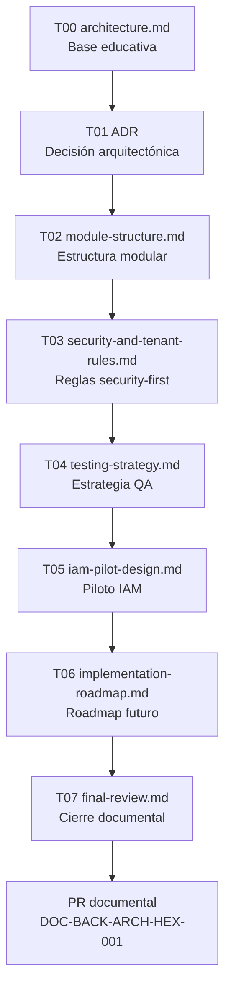
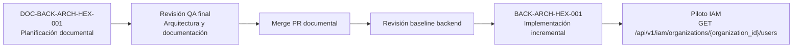

# DOC-BACK-ARCH-HEX-001-T07 — Revisión QA y cierre fase documental

**Estado:** fase documental completada tras revisión arquitectónica y validación QA final.

## Alcance

Esta fase tiene alcance exclusivamente documental:

- No implementa arquitectura hexagonal en el backend.
- No modifica código backend productivo.
- No modifica migraciones, Docker, Makefile, frontend ni configuración de entorno.
- No afirma que existan cambios técnicos ya aplicados en la aplicación.

El objetivo de este cierre es dejar preparada la revisión final del PR documental y establecer las condiciones mínimas para iniciar la fase futura `BACK-ARCH-HEX-001`.

## Resumen de la fase DOC-BACK-ARCH-HEX-001

La fase `DOC-BACK-ARCH-HEX-001` ha definido una planificación documental para evolucionar el backend de Project Guakamole hacia una arquitectura hexagonal pragmática, security-first y compatible con el MVP.

La documentación generada fija criterios de diseño, estructura modular, reglas de seguridad multi-tenant, estrategia de testing, piloto IAM y roadmap de implantación incremental. La fase no cambia el comportamiento del backend: crea una base compartida para que futuros PRs puedan implementar la arquitectura de forma controlada, revisable y trazable.

## Documentos creados

- `architecture.md` — T00.
- `adr-backend-hexagonal-architecture.md` — T01.
- `module-structure.md` — T02.
- `security-and-tenant-rules.md` — T03.
- `testing-strategy.md` — T04.
- `iam-pilot-design.md` — T05.
- `implementation-roadmap.md` — T06.
- `roadmap.md`.

## Resumen por task T00-T06

| Task | Objetivo | Decisión principal | Estado QA |
| --- | --- | --- | --- |
| T00 | Explicar la arquitectura hexagonal pragmática para el equipo backend. | Adoptar una aproximación educativa, incremental y orientada al MVP. | Aprobado. |
| T01 | Registrar la decisión arquitectónica principal. | Usar monolito modular FastAPI con arquitectura hexagonal pragmática, no hexagonal pura. | Aprobado. |
| T02 | Definir la estructura estándar de módulos backend. | Separar dominio, aplicación, infraestructura y API sin sobrediseñar el MVP. | Aprobado. |
| T03 | Establecer reglas de seguridad, dependencias y multi-tenancy. | Hacer obligatorio el `TenantContext` y centralizar policies, repositorios y validaciones tenant. | Aprobado. |
| T04 | Definir la estrategia de testing asociada. | Priorizar tests security-first, aislamiento multi-tenant y contratos por módulo. | Aprobado. |
| T05 | Diseñar el piloto IAM. | Usar IAM como primer módulo piloto para validar el patrón completo. | Aprobado. |
| T06 | Planificar la implantación futura. | Crear un roadmap incremental para `BACK-ARCH-HEX-001` con QA por task. | Aprobado. |

## Decisiones arquitectónicas finales

- El backend continuará planteado como monolito modular FastAPI para el MVP.
- Se adopta una arquitectura hexagonal pragmática, aplicada de forma incremental.
- La arquitectura debe ser security-first desde el diseño, no una capa añadida al final.
- No se adopta una arquitectura hexagonal pura si compromete velocidad, claridad o entrega del MVP.
- No se adoptan microservicios en el MVP.
- IAM será el módulo piloto para validar estructura, reglas de dependencia, seguridad y testing.
- El piloto funcional previsto es `GET /api/v1/iam/organizations/{organization_id}/users`.
- La fase futura de implementación será `BACK-ARCH-HEX-001`.

## Decisiones de seguridad finales

- `TenantContext` será obligatorio en operaciones multi-tenant.
- No se debe confiar en `organization_id` recibido desde frontend, path, query o body sin validarlo contra la identidad autenticada y el contexto autorizado.
- Las policies de autorización deben estar centralizadas y ser testeables.
- Los repositories deben aplicar filtros tenant de forma explícita.
- SQLAlchemy debe usarse de forma parametrizada; no se permite SQL raw inseguro.
- No deben exponerse `password_hash`, secretos, flags ni respuestas correctas.
- Las acciones críticas deben generar auditoría.
- Se mantiene la separación arquitectónica entre Control Plane y Lab Plane.

## Condiciones para iniciar BACK-ARCH-HEX-001

- El PR documental de `DOC-BACK-ARCH-HEX-001` debe estar mergeado.
- El equipo debe entender el contenido de T00-T06 antes de implementar.
- El baseline backend actual debe revisarse antes de mover estructura o introducir patrones.
- QA debe aceptar el roadmap de implantación.
- Cualquier bloqueo detectado debe convertirse en una issue específica y acotada.

## Riesgos residuales

- La autenticación real puede no estar completa en el momento de iniciar la implantación.
- El IAM actual puede estar simplificado respecto al domain model objetivo.
- La implementación puede caer en sobreingeniería si se intenta aplicar hexagonal pura desde el inicio.
- Existe riesgo de que la documentación no se aplique de forma consistente en PRs futuros.
- Existe riesgo de tests insuficientes, especialmente en autorización y aislamiento multi-tenant.

## Recomendaciones mitigadoras

- Implementar incrementalmente y validar cada paso.
- Mantener PRs pequeños y revisables.
- Ejecutar QA por task y no solo al final de la fase.
- Priorizar tests security-first desde el primer PR de implementación.
- Documentar excepciones cuando se aparte el diseño por razones justificadas.
- No mover modelos ni migraciones sin necesidad funcional clara.

## Checklist final documental

- [x] Todos los documentos planificados existen bajo `docs/backend/hexagonal/`.
- [x] T00-T06 constan como validados por QA en esta fase documental.
- [x] No se requieren cambios fuera de `docs/backend/hexagonal/`.
- [x] No se incluyen secretos.
- [x] No se afirma una implementación inexistente.
- [x] El roadmap futuro queda definido.
- [x] Validación QA final del cierre T07.

## Criterios de aceptación de cierre de fase

- `final-review.md` resume el alcance documental y no presenta la fase como implementación realizada.
- El documento enumera los entregables T00-T06 y su estado QA.
- Las decisiones arquitectónicas y de seguridad quedan explícitas.
- Los riesgos residuales y mitigaciones quedan identificados.
- Las condiciones para iniciar `BACK-ARCH-HEX-001` quedan claras.
- `roadmap.md` refleja T07 como redactado/en progreso, no como completado hasta la validación final.

## Próximo paso recomendado

1. Realizar revisión QA final.
2. Preparar commit T07 cuando QA valide el cierre.
3. Hacer push de la branch.
4. Abrir PR documental de fase.
5. Tras el merge, crear o abrir la fase `BACK-ARCH-HEX-001`.

## Relación documental T00-T07

## Transición DOC-BACK-ARCH-HEX-001 → BACK-ARCH-HEX-001

