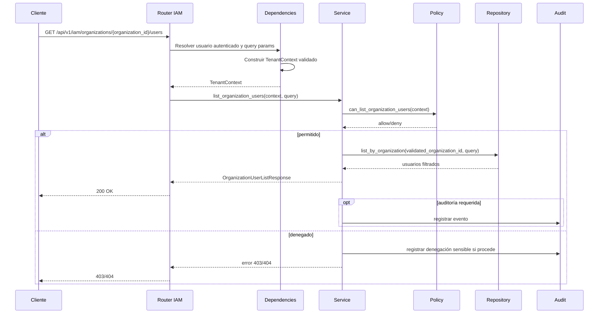
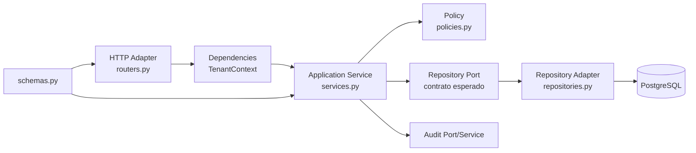
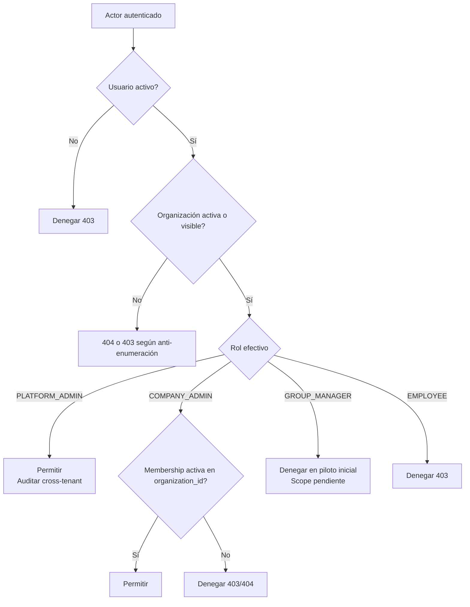

# DOC-BACK-ARCH-HEX-001-T05 — Diseño piloto IAM

**Estado:** fase documental. Pendiente de implantación en `BACK-ARCH-HEX-001`.

Este documento define el diseño del piloto IAM que deberá implementarse en una fase futura. No afirma que el endpoint exista actualmente y no introduce cambios de código, tests, modelos ni migraciones.

## Alcance

El piloto futuro consistirá en diseñar el endpoint:

```http
GET /api/v1/iam/organizations/{organization_id}/users
```

Objetivo funcional: listar usuarios de una organización únicamente cuando el actor autenticado tenga permiso y el `TenantContext` haya validado el acceso a la organización solicitada.

Queda explícitamente fuera de esta task documental:

- No se implementa el endpoint.
- No se crean tests.
- No se modifican modelos ni migraciones.
- No se cambia código backend productivo.
- No se modifica Docker, Makefile, `.env`, `.env.example` ni frontend.

Este documento define contrato, capas, reglas de seguridad, errores esperados, auditoría y pruebas futuras.

## Justificación del piloto

IAM es un dominio crítico porque concentra identidad, pertenencia a organizaciones, roles, autorización y aislamiento multi-tenant. Por ese motivo, este piloto es más adecuado que un CRUD simple para validar la arquitectura hexagonal pragmática security-first.

El caso elegido permite probar de forma controlada:

- Multi-tenancy mediante validación estricta de organización.
- RBAC por rol del actor autenticado.
- Construcción y uso de `TenantContext`.
- Schemas de entrada y salida sin exposición de datos sensibles.
- Filtrado obligatorio en repositorio por `organization_id` validado.
- No exposición de `password_hash` ni credenciales derivadas.
- Separación de responsabilidades entre router, dependencies, service, policy, repository y audit.

## Contrato HTTP propuesto

### Método y ruta

```http
GET /api/v1/iam/organizations/{organization_id}/users
```

### Parámetros de path

| Parámetro | Tipo | Regla |
| --- | --- | --- |
| `organization_id` | Identificador interno del backend | Nunca se confía en él sin validarlo contra la identidad autenticada y el `TenantContext`. En la implementación actual IAM puede corresponder a `id_organization` `BIGINT`; si en el futuro se adopta UUID público, deberá mapearse de forma segura. |

### Query params opcionales seguros

| Parámetro | Tipo | Regla |
| --- | --- | --- |
| `limit` | entero | Valor por defecto bajo y límite máximo obligatorio. Propuesta inicial: defecto `50`, máximo `100`. |
| `offset` | entero | Entero mayor o igual que `0`. |
| `search` | string | Búsqueda parametrizada sobre campos permitidos. Longitud máxima obligatoria. |
| `sort_by` | string | Allowlist estricta. Propuesta: `email`, `display_name`, `status`, `created_at`. |
| `sort_dir` | string | Allowlist estricta: `asc`, `desc`. |

No se aceptarán filtros dinámicos arbitrarios ni nombres de columnas recibidos directamente del cliente.

### Respuesta 200 propuesta

```json
{
  "items": [
    {
      "id": "user-id-or-public-reference",
      "email": "ana@example.com",
      "display_name": "Ana García",
      "status": "ACTIVE",
      "membership_status": "ACTIVE",
      "roles": ["COMPANY_ADMIN"],
      "created_at": "2026-10-05T10:00:00Z",
      "last_login_at": "2026-10-05T11:00:00Z"
    }
  ],
  "limit": 50,
  "offset": 0,
  "total": 1
}
```

`password_hash`, tokens, secretos, claves MFA, datos internos de sesión y cualquier credencial derivada quedan prohibidos en la respuesta. `display_name` podrá ser un campo real o derivado controladamente de `first_name`/`last_name` según el modelo IAM vigente; no debe implicar exponer campos internos no aprobados.

## Schemas propuestos

Los nombres son orientativos y podrán ajustarse al estándar final del backend.

### `UserListQuery`

Responsabilidad: validar query params antes de llegar a service/repository.

Campos permitidos:

- `limit: int`
- `offset: int`
- `search: str | None`
- `sort_by: Literal["email", "display_name", "status", "created_at"]`
- `sort_dir: Literal["asc", "desc"]`

Reglas:

- `limit` con máximo estricto.
- `offset >= 0`.
- `search` con longitud máxima y normalización básica.
- `sort_by` y `sort_dir` mediante allowlist.

### `OrganizationUserRead`

Responsabilidad: representar un usuario visible dentro de una organización.

Campos permitidos:

- `id`
- `email`
- `display_name`
- `status`
- `membership_status`
- `roles` o rol efectivo visible aprobado para la API
- `created_at`
- `last_login_at`

Campos prohibidos:

- `password_hash`
- secretos TOTP/MFA
- tokens de recuperación
- tokens de invitación
- campos internos de autorización no necesarios
- identificadores internos de roles/memberships si no forman parte del contrato público
- metadatos técnicos no aprobados para exposición pública

### `OrganizationUserListResponse`

Responsabilidad: encapsular paginación y resultados.

Campos propuestos:

- `items: list[OrganizationUserRead]`
- `limit: int`
- `offset: int`
- `total: int | None`

`total` podrá ser opcional si la decisión de rendimiento final evita conteos globales en listados grandes.

## Reglas de autorización

| Actor | Resultado esperado |
| --- | --- |
| `PLATFORM_ADMIN` | Puede listar cualquier organización. La operación debe ser auditable, especialmente si cruza tenant. |
| `COMPANY_ADMIN` | Puede listar únicamente usuarios de su propia organización activa. |
| `GROUP_MANAGER` | Fuera del piloto inicial o denegado explícitamente hasta definir scope por grupo. Decisión inicial: denegar. |
| `EMPLOYEE` | Denegado. |
| Usuario deshabilitado | Denegado aunque conserve memberships históricas. |
| Organización deshabilitada | Denegado. |

Decisión documental: `GROUP_MANAGER` queda fuera del piloto porque su visibilidad depende del alcance por grupo y de las reglas de `GroupManager`, que deben definirse sin comprometer aislamiento ni privacidad.

## TenantContext

El `TenantContext` deberá derivarse de la identidad autenticada, memberships activas, roles efectivos y `organization_id` solicitado.

Reglas obligatorias:

- Nunca confiar en `organization_id` del path sin validarlo.
- Validar que el usuario está autenticado y activo.
- Validar que la organización solicitada existe y está activa, salvo estrategia anti-enumeración que oculte esta información.
- Validar membership activa para roles con alcance de organización.
- Permitir bypass controlado a `PLATFORM_ADMIN`, con auditoría reforzada.
- Para acceso cross-tenant no autorizado, decidir entre `403` y `404` según la política anti-enumeración final.

Estrategia recomendada:

- `403` cuando el tenant es conocido por el sistema pero el actor no tiene permiso y no hay riesgo de enumeración adicional.
- `404` cuando se quiera ocultar la existencia de una organización no visible para el actor.
- Mantener consistencia para evitar canales laterales por diferencias de respuesta.

## Capas y archivos futuros esperados

Ubicación futura orientativa:

```text
backend/app/domain/iam/users/
├── routers.py
├── schemas.py
├── services.py
├── policies.py
├── repositories.py
├── dependencies.py
└── models.py
```

`models.py` solo deberá utilizarse si procede. No se moverán modelos existentes sin revisión arquitectónica y QA.

## Responsabilidad por capa

| Capa | Responsabilidad |
| --- | --- |
| `routers.py` | Declarar ruta, método, status codes, dependencias y delegación al service. No debe contener lógica de autorización compleja. |
| `dependencies.py` | Resolver identidad autenticada, sesión de base de datos, query validada y `TenantContext`. |
| `services.py` | Orquestar caso de uso: validar contexto, invocar policy, llamar repository, mapear salida y solicitar auditoría cuando aplique. |
| `policies.py` | Decidir si el actor puede listar usuarios para la organización solicitada. Debe ser testeable sin FastAPI ni base de datos real. |
| `repositories.py` | Consultar datos aplicando siempre `organization_id` validado, paginación y filtros seguros. |
| `schemas.py` | Definir contratos de entrada/salida y evitar exposición de campos sensibles. |
| `audit` | Registrar eventos relevantes según política de auditoría definida. Puede vivir en módulo compartido si ya existe. |

## Flujo de ejecución

```text
Request
  ↓
auth dependency
  ↓
TenantContext
  ↓
service
  ↓
policy
  ↓
repository
  ↓
output schema
  ↓
response
```

## Reglas del repository

- Filtrar siempre por el `organization_id` validado, nunca por un valor de path no validado.
- Aplicar paginación con límites máximos.
- Implementar `search` con consultas parametrizadas.
- Implementar `sort_by` con allowlist de campos permitidos.
- Implementar `sort_dir` con allowlist `asc`/`desc`.
- Evitar SQL raw. Cualquier excepción deberá justificarse, revisarse y cubrirse con tests de seguridad.
- No devolver entidades ORM directamente al router si contienen campos sensibles.
- Asegurar que los joins con membership/roles no rompen el aislamiento entre organizaciones.

## Errores esperados

| Código | Caso |
| --- | --- |
| `401` | Usuario no autenticado o credenciales ausentes/inválidas. |
| `403` | Actor autenticado sin permiso o tenant denegado. |
| `404` | Organización no visible para el actor según estrategia anti-enumeración. |
| `422` | Query params inválidos: límite excesivo, sort no permitido, offset inválido, etc. |
| `500` | Error interno genérico sin detalles sensibles. Debe registrarse en logs técnicos. |

## Auditoría

No se recomienda auditar cada listado ordinario de `COMPANY_ADMIN` por defecto, para evitar ruido y coste operacional, salvo que una decisión futura lo requiera.

Recomendación inicial:

- Auditar siempre listados de `PLATFORM_ADMIN` sobre organizaciones distintas a su contexto operativo habitual.
- Auditar denegaciones sensibles si aportan valor de seguridad y no generan ruido excesivo.
- Registrar errores internos en logs técnicos sin exponer detalles al cliente.
- Revisar en T06 si el evento debe llamarse `IAM_ORGANIZATION_USERS_LISTED`, `USER_LIST_VIEWED` u otro nombre alineado con la taxonomía de auditoría.

## Tests futuros esperados

La implementación futura deberá contemplar, como mínimo:

- Unit tests de `policies.py`.
- Unit tests de `services.py` con fake repository.
- Repository tests con datos multi-tenant.
- Schema tests para query params, allowlists y salida sin campos sensibles.
- API tests del endpoint con usuarios y roles reales de test.
- Security regression tests para IDOR, broken access control y cross-tenant access.
- Casos concretos derivados de T04 (`testing-strategy.md`), incluyendo errores 401/403/404/422.

Casos mínimos:

- `PLATFORM_ADMIN` lista organización A.
- `COMPANY_ADMIN` de ACME lista ACME.
- `COMPANY_ADMIN` de ACME intenta listar CyberCorp y recibe `403` o `404` según política final.
- `EMPLOYEE` recibe denegación.
- Usuario deshabilitado recibe denegación.
- Organización deshabilitada recibe denegación.
- `password_hash` nunca aparece en la respuesta.
- `sort_by` no permitido devuelve `422`.
- `search` no permite inyección SQL.

## Riesgos de seguridad

- IDOR por aceptar `organization_id` del path sin validación real.
- Broken Access Control por policy incompleta o no invocada.
- Enumeración de organizaciones mediante diferencias entre `403`, `404` y tiempos de respuesta.
- Exposición accidental de `password_hash` u otros secretos en schemas o serialización ORM.
- Mass assignment o filtros dinámicos no controlados.
- SQL injection en `search` o `sort`.
- Uso de `PLATFORM_ADMIN` sin auditoría suficiente.
- Joins incorrectos que mezclen memberships de diferentes organizaciones.

## Decisiones abiertas o fuera de alcance

- Scope exacto de `GROUP_MANAGER` para listar usuarios de sus grupos.
- Diseño final de memberships si todavía no está implementado o si la implementación actual usa una relación simplificada usuario-organización/rol.
- Paginación final: `limit/offset` frente a cursor pagination.
- Formato estándar final de error si aún no existe en el backend.
- Taxonomía definitiva de AuditEvents IAM.
- Ubicación final de modelos si el backend actual ya dispone de entidades compartidas.

## Diagramas Mermaid

### Secuencia del endpoint piloto



### Capas hexagonales del piloto IAM



### Matriz/flow de autorización por rol



## Criterios de aceptación del diseño

- El contrato HTTP queda definido sin afirmar implementación existente.
- La respuesta propuesta excluye explícitamente `password_hash` y secretos.
- Las reglas RBAC contemplan `PLATFORM_ADMIN`, `COMPANY_ADMIN`, `GROUP_MANAGER`, `EMPLOYEE`, usuario deshabilitado y organización deshabilitada.
- `TenantContext` queda definido como validación obligatoria derivada de identidad y membership.
- Las responsabilidades por capa son accionables para `python-implementer`.
- Repository filtering, paginación, búsqueda y ordenación quedan definidos con enfoque security-first.
- Los errores esperados y la estrategia 403/404 quedan documentados.
- La auditoría queda recomendada sin generar ruido innecesario.
- Los tests futuros incluyen unit, service, repository, schema, API y regression security tests.
- Los riesgos y decisiones abiertas quedan explícitos.
- Se relaciona con los documentos de arquitectura, estructura, seguridad, testing, T06 y `BACK-ARCH-HEX-001`.

## Relación con documentos y fases

- `architecture.md`: este piloto aterriza la arquitectura hexagonal pragmática en un caso IAM realista.
- `adr-backend-hexagonal-architecture.md`: valida la decisión de separar entrada HTTP, aplicación, políticas y repositorios.
- `module-structure.md`: propone la estructura futura bajo `backend/app/domain/iam/users/`.
- `security-and-tenant-rules.md`: aplica las reglas de TenantContext, RBAC, anti-enumeración y filtrado por tenant.
- `testing-strategy.md`: define los tipos de prueba que deberán cubrir el piloto cuando se implemente.
- T06 roadmap de implantación: deberá convertir este diseño en pasos técnicos ordenados, criterios de revisión y dependencias.
- `BACK-ARCH-HEX-001`: esta será la fase futura donde se implemente, revise y valide el piloto.
