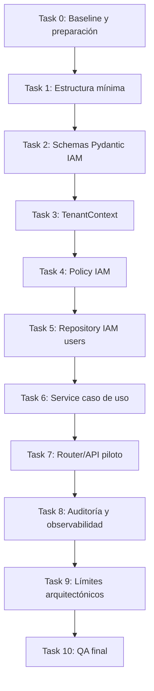
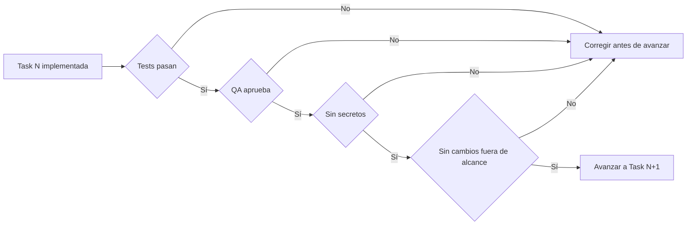

# DOC-BACK-ARCH-HEX-001-T06 — Roadmap de implantación BACK-ARCH-HEX-001

## Estado

Fase documental. Este documento define un roadmap propuesto para la implementación futura de `BACK-ARCH-HEX-001`.

No afirma que la arquitectura hexagonal esté implementada. Su objetivo es dejar una guía técnica, ordenada y verificable para que `python-implementer` y `qa-tester` puedan ejecutar la fase futura sin improvisar arquitectura.

## Alcance

- No implementa código.
- Define el plan futuro de implantación.
- La fase futura se llamará `BACK-ARCH-HEX-001`.
- La implantación deberá ser incremental, con PRs pequeños, revisables y trazables.
- No modifica frontend.
- No modifica migraciones, Docker, Makefile, `.env` ni `.env.example` durante esta fase documental.
- La futura implantación deberá mantener compatibilidad con el backend existente y con las migraciones Alembic ya disponibles.

## Branch sugerida para la fase futura

Branch principal sugerida:

```text
backend/BACK-ARCH-HEX-001-implantacion-hexagonal
```

Alternativa si se quiere separar el piloto IAM en PRs más pequeños:

```text
backend/BACK-ARCH-HEX-001-baseline
backend/BACK-ARCH-HEX-001-iam-schemas
backend/BACK-ARCH-HEX-001-iam-policy
backend/BACK-ARCH-HEX-001-iam-api
```

Si la implementación crece, se deberá dividir en varias branches/PRs. La prioridad es mantener cambios pequeños, auditables y fáciles de revertir.

## Principios de implantación

- **No refactor masivo:** no reordenar todo el backend en una sola PR.
- **Primero piloto IAM:** validar la arquitectura con un caso acotado antes de extenderla a otros dominios.
- **Security-first:** autorización, tenant context, validación, auditoría y no exposición de datos sensibles deben diseñarse antes de generalizar patrones.
- **Tests antes o durante cada task:** cada cambio debe llegar acompañado de pruebas mínimas.
- **QA por task:** no avanzar por acumulación de deuda pendiente.
- **Compatibilidad con migraciones existentes:** no romper Alembic ni modelos operacionales existentes.
- **Sin frontend:** cualquier adaptación de UI deberá planificarse como fase separada posterior.
- **Sin secretos:** no introducir credenciales, tokens ni valores reales en código, documentación o tests.

## Gates obligatorios entre tasks

Antes de avanzar de una task a la siguiente deberán cumplirse estos gates:

- QA aprueba la task anterior.
- Tests mínimos de la task pasan.
- No hay secretos ni datos sensibles añadidos.
- No hay cambios fuera de alcance.
- No se han roto imports, migraciones ni compatibilidad básica del backend.
- La documentación de la task queda actualizada.

## Comandos esperados de validación

Estos comandos deberán ejecutarse según aplique en la fase futura. No se incluyen outputs en este documento.

```bash
make backend-check
uv run ruff check .
uv run ruff format --check .
uv run mypy --strict .
uv run pytest
make db-upgrade
```

`make db-upgrade` solo aplicará si la task introduce o valida migraciones.

## Roadmap futuro por tasks

### Task 0 — Baseline y preparación

#### Objetivo

Establecer una línea base verificable antes de tocar código. Esta task no debe introducir cambios funcionales.

#### Archivos esperados o áreas afectadas

- Documentación de seguimiento de la fase futura.
- Estado actual de `backend/` e IAM.
- Configuración de tests existente, sin modificarla salvo necesidad justificada en otra task.

#### Subtasks

1. Revisar documentos T00-T06.
2. Revisar el estado actual del backend y del módulo IAM.
3. Confirmar que los tests actuales pasan.
4. Confirmar que Alembic está en head.
5. Identificar dependencias reales disponibles: autenticación, usuario autenticado, roles, organizaciones y modelos existentes.
6. Documentar limitaciones encontradas antes de implementar.

#### Tests mínimos

- Ejecutar suite existente con `uv run pytest`.
- Ejecutar checks de calidad disponibles, preferiblemente `make backend-check` si está operativo.
- Ejecutar `make db-upgrade` si el entorno de base de datos está preparado para validar migraciones.

#### Criterios de aceptación

- Estado inicial documentado.
- Tests existentes revisados.
- Migraciones revisadas sin introducir cambios.
- No hay cambios funcionales.
- QA confirma que se puede iniciar la implementación incremental.

#### Riesgos de seguridad

- Partir de supuestos incorrectos sobre autenticación o roles.
- No detectar deuda multi-tenant existente antes de implementar el piloto.

#### Documentación esperada

- Nota de baseline en la documentación de la fase futura.
- Limitaciones explícitas si auth real, roles o tenant context aún no existen.

### Task 1 — Estructura mínima sin comportamiento

#### Objetivo

Crear la estructura mínima necesaria para el piloto IAM sin mover modelos existentes ni modificar comportamiento.

#### Archivos esperados o áreas afectadas

- `backend/app/domain/iam/users/` solo si aplica.
- `__init__.py` si procede según el estándar del proyecto.
- Tests o checks de imports si son necesarios.

#### Subtasks

1. Crear únicamente carpetas necesarias para el piloto.
2. Añadir `__init__.py` cuando el paquete lo requiera.
3. No mover modelos SQLAlchemy existentes.
4. No cambiar routers productivos todavía.
5. Validar que el backend sigue importando correctamente.

#### Tests mínimos

- Tests de importación si aplica.
- `uv run pytest` o subconjunto mínimo acordado por QA.
- `uv run ruff check .`.

#### Criterios de aceptación

- Estructura mínima creada sin comportamiento nuevo.
- Sin cambios funcionales en endpoints.
- Sin cambios en migraciones.
- Imports estables.

#### Riesgos de seguridad

- Crear estructura que invite a duplicar lógica sensible.
- Introducir paquetes ambiguos que dificulten revisar dependencias.

#### Documentación esperada

- Descripción breve de estructura creada y motivo.
- Confirmación de que no se han movido modelos existentes.

### Task 2 — Schemas Pydantic del piloto IAM

#### Objetivo

Definir los contratos seguros del caso de uso de listado de usuarios de organización.

#### Archivos esperados o áreas afectadas

- Schemas del piloto IAM.
- Tests unitarios de schemas.

#### Subtasks

1. Definir `UserListQuery` o equivalente.
2. Definir `OrganizationUserRead`.
3. Definir `OrganizationUserListResponse`.
4. Validar `limit`, `offset`, `search` y `sort` con allowlist.
5. Garantizar que `password_hash` no forma parte de los schemas de salida.
6. Documentar campos expuestos y campos excluidos.

#### Tests mínimos

- Tests unitarios de validación de `limit` y `offset`.
- Tests unitarios de `search` con valores vacíos, normales y maliciosos.
- Tests unitarios de `sort` contra allowlist.
- Test explícito de no exposición de `password_hash`.

#### Criterios de aceptación

- Schemas validan entradas con límites claros.
- La respuesta no expone credenciales ni hashes.
- Errores de validación son predecibles.
- No hay acceso a base de datos desde schemas.

#### Riesgos de seguridad

- Exponer campos internos del usuario.
- Permitir `sort` arbitrario que derive en inyección o errores de consulta.
- Permitir paginación sin límites.

#### Documentación esperada

- Contrato de entrada/salida del endpoint piloto.
- Campos excluidos por seguridad.

### Task 3 — TenantContext y dependencias base

#### Objetivo

Diseñar e implementar el `TenantContext` mínimo necesario para ejecutar el caso de uso sin confiar ciegamente en `organization_id` enviado por el cliente.

#### Archivos esperados o áreas afectadas

- Dependencias base de IAM o core.
- Modelo/DTO interno de `TenantContext`.
- Tests unitarios de construcción y validación.

#### Subtasks

1. Diseñar `TenantContext` con identidad autenticada, organización efectiva y roles disponibles.
2. Resolver identidad autenticada real o mocks controlados si auth real aún no existe.
3. Validar que `organization_id` del path se contrasta contra la identidad autenticada.
4. Documentar limitaciones si auth real no está disponible.
5. Evitar dependencias directas desde routers a detalles de persistencia.

#### Tests mínimos

- Construcción válida de `TenantContext`.
- Organización del path no autorizada produce denegación.
- Usuario sin membresía válida produce denegación.
- Auth mock documentada y acotada si se usa.

#### Criterios de aceptación

- No se confía en `organization_id` del path sin validación.
- La dependencia es testeable.
- Las limitaciones de autenticación están documentadas.

#### Riesgos de seguridad

- Cross-tenant access por aceptar `organization_id` del navegador.
- Mocks de auth que queden activos fuera de tests.

#### Documentación esperada

- Explicación de `TenantContext` mínimo.
- Limitaciones temporales si no existe auth real completa.

### Task 4 — Policy IAM para listar usuarios

#### Objetivo

Implementar la policy de autorización del piloto antes de acceder al repository.

#### Archivos esperados o áreas afectadas

- Policy IAM del caso de uso.
- Tests unitarios positivos y negativos.

#### Subtasks

1. Definir reglas para `PLATFORM_ADMIN`.
2. Definir reglas para `COMPANY_ADMIN`.
3. Denegar `GROUP_MANAGER` para este listado general, salvo decisión arquitectónica posterior documentada.
4. Denegar `EMPLOYEE`.
5. Denegar usuarios deshabilitados.
6. Denegar organizaciones deshabilitadas.
7. Devolver errores seguros sin filtrar información sensible.

#### Tests mínimos

- `PLATFORM_ADMIN` autorizado según alcance definido.
- `COMPANY_ADMIN` autorizado solo dentro de su organización.
- `GROUP_MANAGER` denegado.
- `EMPLOYEE` denegado.
- Usuario disabled denegado.
- Organización disabled denegada.
- Cross-tenant denegado.

#### Criterios de aceptación

- Policy testeada sin base de datos real si es posible.
- Reglas explícitas y no implícitas.
- Denegaciones seguras y consistentes.

#### Riesgos de seguridad

- Permisos demasiado amplios para managers.
- Diferencias de respuesta que permitan enumerar organizaciones.

#### Documentación esperada

- Matriz de permisos del endpoint piloto.
- Decisiones sobre `GROUP_MANAGER` y alcance.

### Task 5 — Repository IAM users

#### Objetivo

Implementar el acceso a datos del listado de usuarios filtrado por `organization_id` validado y con consultas seguras.

#### Archivos esperados o áreas afectadas

- Repository de usuarios IAM.
- Tests con datos multi-tenant.
- Fixtures de base de datos si existen.

#### Subtasks

1. Implementar filtro obligatorio por organización validada.
2. Añadir paginación con límites.
3. Añadir búsqueda parametrizada.
4. Añadir ordenación mediante allowlist.
5. Evitar SQL dinámico no parametrizado.
6. No devolver `password_hash` ni campos internos innecesarios.

#### Tests mínimos

- Usuario de ACME no lista usuarios de CyberCorp.
- Paginación correcta.
- Search parametrizado.
- Sort válido funciona.
- Sort no permitido falla de forma controlada.
- Payload tipo SQL injection en `search` no rompe ni altera el aislamiento.

#### Criterios de aceptación

- Todas las consultas aplican filtro tenant.
- No hay SQL raw inseguro.
- Datos sensibles excluidos.
- Tests multi-tenant pasan.

#### Riesgos de seguridad

- Olvidar `organization_id` en joins.
- Inyección por search/sort.
- Exposición accidental de hashes.

#### Documentación esperada

- Explicación del filtrado tenant.
- Campos disponibles para search/sort.

### Task 6 — Service del caso de uso

#### Objetivo

Implementar el service que orquesta policy, repository, mapeo seguro y auditoría.

#### Archivos esperados o áreas afectadas

- Service del caso de uso IAM.
- DTOs/schemas de salida.
- Fakes de repository/audit para tests.

#### Subtasks

1. Invocar policy antes que repository.
2. Llamar al repository solo si la autorización es válida.
3. Mapear entidades a schemas/DTOs seguros.
4. Preparar integración con auditoría según diseño.
5. Mantener el service independiente del router.

#### Tests mínimos

- Si policy deniega, repository no se invoca.
- Si policy permite, repository se invoca con organización validada.
- Mapeo no expone `password_hash`.
- Audit fake recibe eventos esperados si aplica.

#### Criterios de aceptación

- Flujo de autorización antes de datos demostrado por tests.
- Service testeable sin FastAPI.
- Errores controlados.

#### Riesgos de seguridad

- Consultar datos antes de autorizar.
- Mapear entidades completas a respuesta pública.

#### Documentación esperada

- Descripción del caso de uso.
- Secuencia policy → repository → mapping → audit.

### Task 7 — Router/API piloto

#### Objetivo

Exponer el endpoint piloto integrando dependencies, service y schemas sin saltarse las capas definidas.

#### Archivos esperados o áreas afectadas

- Router IAM.
- Dependencies de FastAPI.
- Tests API.

#### Subtasks

1. Implementar `GET /api/v1/iam/organizations/{organization_id}/users`.
2. Integrar `TenantContext`.
3. Integrar service.
4. Usar schemas de entrada/salida.
5. Controlar errores 401, 403, 404, 422 y 500.
6. Evitar SQLAlchemy directo en router.

#### Tests mínimos

- 401 sin identidad válida.
- 403 sin permisos.
- 422 con query inválida.
- 200 con permisos correctos.
- Cross-tenant denegado.
- Respuesta sin `password_hash`.

#### Criterios de aceptación

- Endpoint funcional bajo el patrón definido.
- Router no contiene lógica de negocio ni consultas directas.
- Errores seguros y consistentes.

#### Riesgos de seguridad

- Saltarse policy desde el router.
- Filtrar existencia de organizaciones mediante 404/403 inconsistentes.

#### Documentación esperada

- Contrato API del endpoint piloto.
- Casos de error y permisos requeridos.

### Task 8 — Auditoría y observabilidad mínima

#### Objetivo

Registrar eventos mínimos relevantes del piloto sin introducir secretos ni datos sensibles.

#### Archivos esperados o áreas afectadas

- Servicio/adaptador de auditoría si existe.
- Tests de audit events.
- Logs estructurados si ya hay patrón disponible.

#### Subtasks

1. Definir eventos para acceso autorizado si aporta valor.
2. Definir eventos para denegaciones sensibles, como cross-tenant o rol insuficiente.
3. Registrar actor, organización, acción y correlación si está disponible.
4. No registrar passwords, hashes, tokens ni payloads sensibles.
5. Alinear nombres de eventos con el modelo de auditoría del proyecto.

#### Tests mínimos

- Evento generado en denegación sensible si aplica.
- Evento generado en acceso autorizado si se decide registrar.
- No se registran secretos ni hashes.
- Audit fake verificable en tests.

#### Criterios de aceptación

- Eventos mínimos documentados.
- Auditoría no rompe el flujo principal.
- Sin información sensible en logs/audit.

#### Riesgos de seguridad

- Registrar datos personales o secretos innecesarios.
- Generar demasiado ruido y dificultar detección real.

#### Documentación esperada

- Lista de eventos auditables del piloto.
- Campos permitidos y campos prohibidos.

### Task 9 — Tests de límites arquitectónicos

#### Objetivo

Validar que el piloto respeta dependencias y límites de arquitectura hexagonal pragmática.

#### Archivos esperados o áreas afectadas

- Tests/checks de imports si aplica.
- Reglas de arquitectura documentadas.

#### Subtasks

1. Añadir checks de imports prohibidos si el proyecto lo permite.
2. Verificar que routers no usan SQLAlchemy directo.
3. Verificar que routers no dependen de adapters externos.
4. Verificar que models no importan routers ni services.
5. Documentar excepciones si alguna dependencia no puede corregirse todavía.

#### Tests mínimos

- Test o check de dependencias prohibidas.
- Test específico de router sin SQLAlchemy directo si es viable.
- Revisión QA de imports.

#### Criterios de aceptación

- Límites arquitectónicos verificados.
- Excepciones documentadas y acotadas.
- No se introduce refactor masivo para satisfacer checks.

#### Riesgos de seguridad

- Saltarse capas y duplicar autorización.
- Acoplar dominio a infraestructura.

#### Documentación esperada

- Resultado de checks arquitectónicos.
- Deuda técnica pendiente si existe.

### Task 10 — QA final de fase implementación

#### Objetivo

Cerrar `BACK-ARCH-HEX-001` con validación técnica, seguridad, documentación y revisión de alcance.

#### Archivos esperados o áreas afectadas

- Documentación de cierre.
- Registro de comandos ejecutados sin outputs sensibles.
- Lista de riesgos restantes.

#### Subtasks

1. Ejecutar `make backend-check`.
2. Ejecutar `uv run ruff check .`.
3. Ejecutar `uv run ruff format --check .`.
4. Ejecutar `uv run mypy --strict .`.
5. Ejecutar `uv run pytest`.
6. Ejecutar `make db-upgrade` si aplica.
7. Revisar diffs completos.
8. Revisar seguridad: secretos, tenant isolation, exposición de datos, errores.
9. Preparar documentación de cierre.

#### Tests mínimos

- Suite completa backend.
- Tests unitarios de schemas, policy y service.
- Tests repository multi-tenant.
- Tests API.
- Checks arquitectónicos.

#### Criterios de aceptación

- Todos los checks acordados pasan o las excepciones quedan justificadas.
- No hay secretos.
- No hay cambios fuera de alcance.
- Documentación actualizada.
- QA aprueba cierre de fase.

#### Riesgos de seguridad

- Cerrar la fase con excepciones no documentadas.
- Aceptar fallos de tests como deuda no priorizada.

#### Documentación esperada

- Informe de cierre de `BACK-ARCH-HEX-001`.
- Relación de PRs.
- Riesgos residuales.
- Recomendación para extender el patrón a otros módulos.

## Diagrama Mermaid del roadmap futuro



## Diagrama Mermaid de gates QA entre tasks



## Riesgos del roadmap

| Riesgo | Impacto | Mitigación |
| --- | --- | --- |
| Auth real no disponible | El `TenantContext` puede depender de mocks temporales. | Documentar mocks, acotarlos a tests/desarrollo y no asumir seguridad real hasta integrar auth definitiva. |
| IAM actual simplificado frente al domain model | Las reglas reales pueden ser menos completas que el modelo objetivo. | Implementar solo el piloto, dejar limitaciones explícitas y no generalizar antes de validar. |
| Sobreingeniería | Riesgo de crear capas innecesarias para un MVP. | Aplicar arquitectura hexagonal pragmática: capas mínimas, caso de uso real y PRs pequeños. |
| Romper migraciones/imports | Puede bloquear el backend o CI. | No mover modelos existentes al inicio, validar Alembic head y añadir checks de imports. |
| Tests lentos o frágiles | Puede frenar la iteración. | Priorizar unit tests en schemas/policy/service y limitar integration tests a flujos críticos multi-tenant. |
| Exposición de datos sensibles | Riesgo crítico en IAM. | Tests explícitos de no exposición de `password_hash`, allowlists y revisión QA security-first. |
| Cross-tenant access | Riesgo crítico para el modelo B2B. | `TenantContext`, policy previa a repository y tests multi-tenant obligatorios. |

## Estrategias de mitigación

- Mantener el piloto limitado al listado de usuarios IAM.
- Aplicar autorización antes de cualquier consulta de datos.
- Usar allowlists para sort y campos expuestos.
- Documentar cada excepción arquitectónica.
- Evitar cambios simultáneos en modelos, migraciones y routers.
- Separar PRs por responsabilidad: estructura, schemas, context, policy, repository, service, API y QA.
- Añadir tests negativos desde el principio.
- Revisar diffs completos antes de cada merge.

## Criterios de aceptación de BACK-ARCH-HEX-001

La fase futura `BACK-ARCH-HEX-001` podrá aceptarse cuando:

- Exista un piloto IAM implementado de forma incremental.
- El endpoint de listado de usuarios de organización respete tenant isolation.
- Las policies se ejecuten antes del acceso a datos.
- `password_hash` y campos sensibles no se expongan.
- Existan tests unitarios de schemas, policy y service.
- Existan tests repository/API con casos multi-tenant.
- Los checks de calidad acordados pasen.
- No se hayan introducido secretos.
- No se haya modificado frontend.
- No se haya realizado un refactor masivo fuera del piloto.
- La documentación de cierre recoja decisiones, limitaciones y deuda técnica.

## Relación con documentos T00-T05 y T07

- **T00 — Documento educativo:** aporta el contexto formativo de arquitectura hexagonal pragmática.
- **T01 — ADR:** fija la decisión arquitectónica que este roadmap convierte en plan ejecutable.
- **T02 — Estándar de estructura backend por módulos:** guía la ubicación de carpetas, capas y responsabilidades.
- **T03 — Reglas de dependencias, seguridad y multi-tenancy:** define los límites obligatorios que cada task debe respetar.
- **T04 — Estrategia de testing:** determina los tipos de prueba y el enfoque QA por task.
- **T05 — Diseño piloto IAM:** concreta el caso de uso que se implantará primero.
- **T06 — Este documento:** ordena la implantación futura de `BACK-ARCH-HEX-001`.
- **T07 — Revisión QA y cierre fase documental:** deberá validar este roadmap documental antes de considerarlo completado.

## Nota final

Este roadmap no sustituye a la revisión arquitectónica ni a QA. T06 queda redactada como propuesta de implantación, pero no debe marcarse como completada hasta que T07 confirme que el plan es coherente, seguro y ejecutable.
