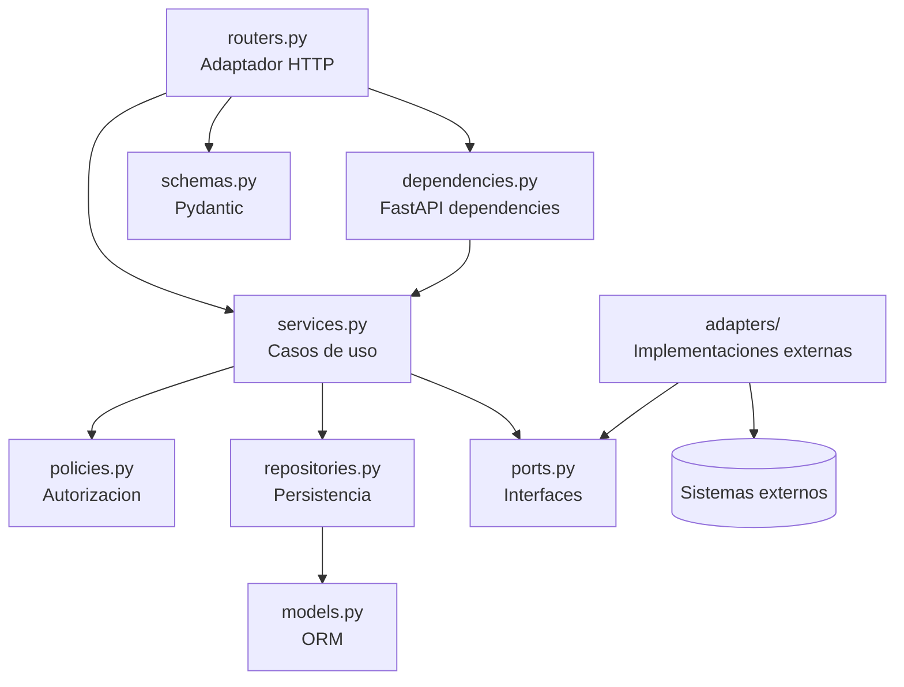
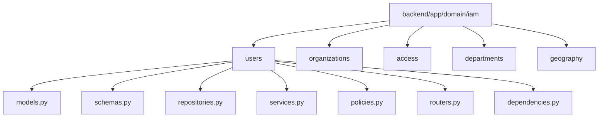
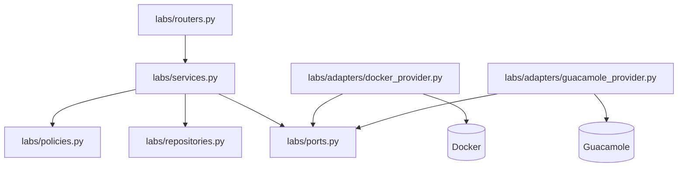

# DOC-BACK-ARCH-HEX-001-T02 — Estándar de estructura backend por módulos

**Estado:** fase documental. Pendiente de implantación en `BACK-ARCH-HEX-001`.

Este documento define el estándar objetivo para organizar módulos backend en Project Guakamole siguiendo una arquitectura hexagonal pragmática y security-first. No describe una estructura ya implantada ni autoriza movimientos de código por sí mismo.

## Alcance

- Define el estándar documental objetivo para futuras evoluciones del backend.
- No implica que la estructura descrita exista actualmente en el repositorio.
- No obliga a realizar un refactor masivo.
- Se aplicará de forma incremental, preferentemente en nuevos módulos, nuevas funcionalidades o pilotos controlados.
- Cualquier reorganización de código existente deberá realizarse en la fase futura `BACK-ARCH-HEX-001`, con tests, revisión arquitectónica y QA.

## Principios

- **Monolito modular FastAPI:** el backend sigue siendo un único despliegue, organizado por dominios o bounded contexts.
- **Arquitectura hexagonal pragmática:** se separan responsabilidades sin introducir abstracciones innecesarias en CRUD simple.
- **Security-first:** la estructura debe facilitar autenticación, autorización, multi-tenancy, validación, auditoría y ausencia de secretos expuestos.
- **Módulos por dominio/bounded context:** IAM, Labs, Scenarios, Audit, Progress u otros dominios deben evolucionar con límites claros.
- **Separación de entrada HTTP, casos de uso, autorización, persistencia e integraciones externas:** los routers no deben concentrar reglas de negocio, permisos, queries complejas ni llamadas directas a proveedores externos.

## Estructura objetivo para módulos pequeños

Para módulos acotados, con un único subdominio o complejidad baja, la estructura objetivo será:

```text
backend/app/domain/<module>/
├── routers.py
├── schemas.py
├── services.py
├── policies.py
├── repositories.py
├── models.py
└── dependencies.py
```

Esta estructura permite mantener la cohesión sin fragmentar prematuramente el código. Si el módulo crece, podrá evolucionar hacia subdominios.

## Estructura objetivo para módulos grandes

Los dominios extensos deberán organizarse por subdominios. IAM es el ejemplo principal:

```text
backend/app/domain/iam/
├── users/
│   ├── models.py
│   ├── schemas.py
│   ├── repositories.py
│   ├── services.py
│   ├── policies.py
│   ├── routers.py
│   └── dependencies.py
├── organizations/
├── access/
├── departments/
└── geography/
```

Cada subdominio debe tener una responsabilidad clara. Por ejemplo, `users` no debería asumir reglas de `departments` salvo mediante servicios o políticas explícitas.

## Convivencia con la estructura actual IAM

Actualmente existen modelos y schemas en subdominios bajo `backend/app/domain/iam/`. La fase futura deberá evolucionar esa estructura de forma incremental, sin romper migraciones ni imports existentes.

Reglas de transición:

- No mover modelos existentes sin tests automatizados y revisión QA.
- No cambiar rutas de imports de forma masiva sin necesidad justificada.
- Priorizar nuevos archivos o nuevas funcionalidades antes que reorganizaciones amplias.
- Mantener compatibilidad con Alembic y SQLAlchemy durante cualquier transición.
- Documentar explícitamente cada movimiento de código en el PR correspondiente de `BACK-ARCH-HEX-001`.

## Responsabilidades por tipo de archivo

### `routers.py`

Adaptador HTTP FastAPI. Define rutas, parámetros, dependencias HTTP y códigos de respuesta.

Debe:

- importar `schemas`, `services` y `dependencies`;
- delegar el caso de uso en servicios;
- mantener la lógica de autorización fuera del router salvo composición de dependencias;
- evitar queries SQLAlchemy directas;
- evitar lógica de negocio.

### `schemas.py`

Modelos Pydantic de entrada y salida.

Debe:

- validar estructura de payloads;
- definir respuestas explícitas;
- evitar exponer `password_hash`, secretos, flags, respuestas correctas o credenciales temporales;
- separar schemas de entrada, salida y actualización cuando sea necesario.

### `services.py`

Casos de uso y orquestación de dominio.

Debe:

- coordinar policies, repositories, puertos y auditoría;
- contener la lógica de aplicación;
- gestionar transacciones cuando aplique;
- ser el punto natural para acciones críticas auditables;
- evitar depender directamente de detalles HTTP.

### `policies.py`

Reglas de autorización y seguridad del dominio.

Debe:

- aplicar RBAC, scopes, pertenencia a organización y `TenantContext`;
- comprobar permisos antes del acceso a datos sensibles;
- evitar dependencias directas de FastAPI;
- evitar dependencias directas de SQLAlchemy salvo justificación concreta y documentada;
- ser fácil de probar con tests unitarios.

### `repositories.py`

Persistencia con SQLAlchemy.

Debe:

- contener queries y operaciones de lectura/escritura;
- usar queries parametrizadas;
- aplicar filtros multi-tenant con la organización validada cuando corresponda;
- devolver entidades o DTOs internos, no respuestas HTTP;
- evitar reglas de autorización de alto nivel, que corresponden a policies/services.

### `models.py`

Modelos ORM SQLAlchemy.

Debe:

- definir tablas, relaciones y columnas;
- no importar routers ni services;
- no devolverse directamente como respuesta HTTP;
- mantenerse alineado con migraciones y convenciones de base de datos.

### `dependencies.py`

Dependencias FastAPI del módulo.

Debe:

- resolver usuario actual, sesión de base de datos, `TenantContext` y servicios;
- componer dependencias comunes del módulo;
- no contener lógica de negocio compleja.

### `ports.py`

Protocols o interfaces para capacidades externas o dependencias que convenga desacoplar.

Debe usarse cuando aporte testabilidad, reduzca acoplamiento o permita sustituir proveedores.

### `adapters.py` o `adapters/`

Implementaciones concretas de puertos externos.

Debe:

- encapsular Docker, Guacamole, GitHub, proveedores de auditoría u otros sistemas externos;
- no ser llamado directamente desde routers;
- ser invocado desde services mediante puertos o factorías controladas.

## Cuándo usar `ports.py`

`ports.py` será recomendado u obligatorio en dominios donde hay proveedores externos, infraestructura variable o necesidad clara de mocks en tests.

Uso recomendado/obligatorio:

- Labs y Lab Providers.
- Guacamole y acceso remoto.
- GitHub como fuente de contenido de escenarios.
- Proveedores de auditoría o emisión de eventos.
- Integraciones donde se prevean varias implementaciones.

Uso opcional:

- CRUD simple sin integración externa.
- Repositorios pequeños donde una interfaz adicional no mejore los tests ni la claridad.

Regla pragmática: si el puerto mejora la testabilidad, reduce acoplamiento o evita que el dominio dependa de una tecnología concreta, debe considerarse.

## Estructura para integraciones externas

Ejemplo objetivo para Labs:

```text
backend/app/domain/labs/
├── services.py
├── policies.py
├── ports.py
├── repositories.py
├── adapters/
│   ├── docker_provider.py
│   └── guacamole_provider.py
└── routers.py
```

El router inicia el flujo HTTP, el service ejecuta el caso de uso, las policies autorizan, el repository persiste `LabSession` y los adapters implementan proveedores externos detrás de puertos.

## Imports permitidos y prohibidos

### Permitidos

- `routers.py` puede importar `schemas`, `services` y `dependencies`.
- `services.py` puede importar `policies`, `repositories`, `ports`, schemas internos si aplica y servicios transversales como auditoría.
- `policies.py` puede importar tipos de dominio y objetos de contexto como `TenantContext`.
- `repositories.py` puede importar SQLAlchemy, `models.py` y tipos internos de consulta.
- `adapters/` puede importar `ports.py` y SDKs/librerías externas necesarias.

### Prohibidos o no recomendados

- `models.py` no importa routers, services ni adapters.
- `routers.py` no importa `models.py` para devolver ORM directamente.
- `routers.py` no llama adapters externos directamente.
- `policies.py` no debe depender de FastAPI.
- `policies.py` no debe depender de SQLAlchemy salvo excepción justificada.
- `repositories.py` no debe depender de FastAPI.
- Un subdominio no debe acceder a tablas sensibles de otro subdominio sin pasar por un service/repository autorizado o una dependencia explícita.

## Diagrama de dependencias permitidas



## Reglas security-first de estructura

- Todo endpoint protegido debe resolver identidad y `TenantContext`.
- La policy de autorización debe ejecutarse antes de acceder a datos sensibles.
- Los repositories multi-tenant deben filtrar por la organización validada, no por un `organization_id` sin comprobar recibido del cliente.
- Los schemas de salida no exponen `password_hash`, secretos, flags, respuestas correctas ni credenciales internas.
- No se usará SQL raw salvo excepción justificada, parametrizada y revisada.
- Las acciones críticas deben pasar por service para poder auditarse de forma consistente.
- Las integraciones externas deben quedar detrás de services/ports/adapters, no en routers.
- Las decisiones de autorización deben ser testeables sin levantar la aplicación completa.

## Convenciones de nombres

- Services: `<Domain>Service` o `<UseCase>Service`.
- Policies: `<Domain>Policy` o `<Action>Policy`.
- Repositories: `<Entity>Repository`.
- Ports: `<Capability>Port` o `<Provider>Port`.
- Adapters: `<Technology><Capability>Adapter` o `<Technology>Provider`.

Ejemplos:

- `UserService`, `ListOrganizationUsersService`.
- `UserPolicy`, `ListOrganizationUsersPolicy`.
- `UserRepository`.
- `LabProviderPort`, `RemoteAccessProviderPort`.
- `DockerProvider`, `GuacamoleProvider`.

## Piloto IAM futuro recomendado

Caso candidato para `BACK-ARCH-HEX-001`:

```text
GET /api/v1/iam/organizations/{organization_id}/users
```

Subdominio sugerido:

```text
backend/app/domain/iam/users/
```

Archivos a crear o evolucionar en la fase futura:

- `routers.py`: define el endpoint HTTP y delega en el service.
- `schemas.py`: define `OrganizationUserRead` y posibles filtros de consulta seguros.
- `services.py`: orquesta el listado de usuarios, invoca policy, repository y auditoría si aplica.
- `policies.py`: valida que el actor pertenece a la organización y tiene permiso para listar usuarios.
- `repositories.py`: consulta usuarios filtrando por `organization_id` ya validado.
- `dependencies.py`: resuelve sesión, usuario actual, tenant context y service.
- `models.py`: solo si el subdominio necesita definir o mantener modelos ORM propios; no debe moverse código existente sin revisión.

El piloto deberá demostrar el flujo mínimo: HTTP → dependencia de identidad/tenant → policy → service → repository → schema de salida.

## Diagrama de estructura IAM futura



## Diagrama de módulo Labs con ports/adapters



## Anti-patrones

- Router con query SQLAlchemy directa.
- Permisos inline en router.
- Devolver un modelo ORM como response HTTP.
- Adapter Docker llamado directamente desde router.
- `organization_id` usado sin validarlo contra la identidad autenticada y el `TenantContext`.
- SQL raw concatenado con valores de entrada.
- Schemas de salida con campos sensibles.
- Services que dependen de `Request` de FastAPI sin necesidad.
- Policies mezcladas con persistencia compleja.
- Repositories que deciden permisos de negocio.

## Criterios de aceptación del documento

- Define una estructura objetivo para módulos pequeños y grandes.
- Aclara que la estructura no está necesariamente implantada.
- Explica la convivencia con la estructura IAM actual.
- Describe responsabilidades de routers, schemas, services, policies, repositories, models, dependencies, ports y adapters.
- Incluye reglas de imports permitidos y prohibidos.
- Incluye reglas security-first aplicables a multi-tenancy, autorización, outputs y auditoría.
- Define cuándo usar `ports.py`.
- Incluye ejemplo de integraciones externas con Labs.
- Incluye piloto IAM futuro para `GET /api/v1/iam/organizations/{organization_id}/users`.
- Incluye diagramas Mermaid de dependencias, IAM y Labs.
- Enumera anti-patrones relevantes.
- No afirma que la estructura ya esté implementada.

## Relación con otros documentos y fases

- `architecture.md`: este documento concreta la estructura de módulos necesaria para aplicar la arquitectura hexagonal pragmática descrita a nivel general.
- `adr-backend-hexagonal-architecture.md`: materializa la decisión arquitectónica en una guía práctica para implementadores.
- T03 — Reglas de seguridad: deberá profundizar en autorización, multi-tenancy, dependencias permitidas y controles security-first.
- T05 — Piloto IAM: deberá usar este estándar para diseñar el caso piloto IAM sin refactor masivo.
- `BACK-ARCH-HEX-001`: será la fase futura de implantación incremental, con código, tests, revisión arquitectónica y QA.
