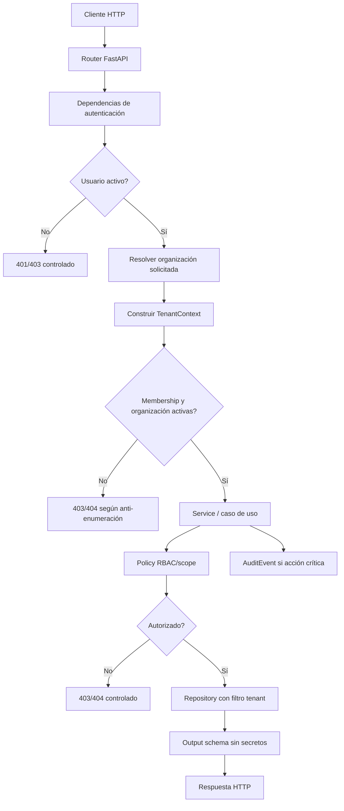
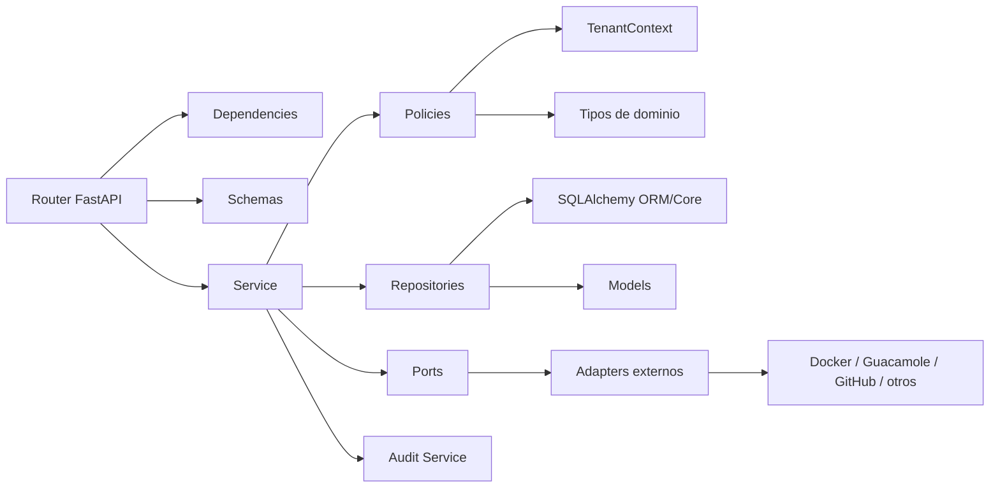
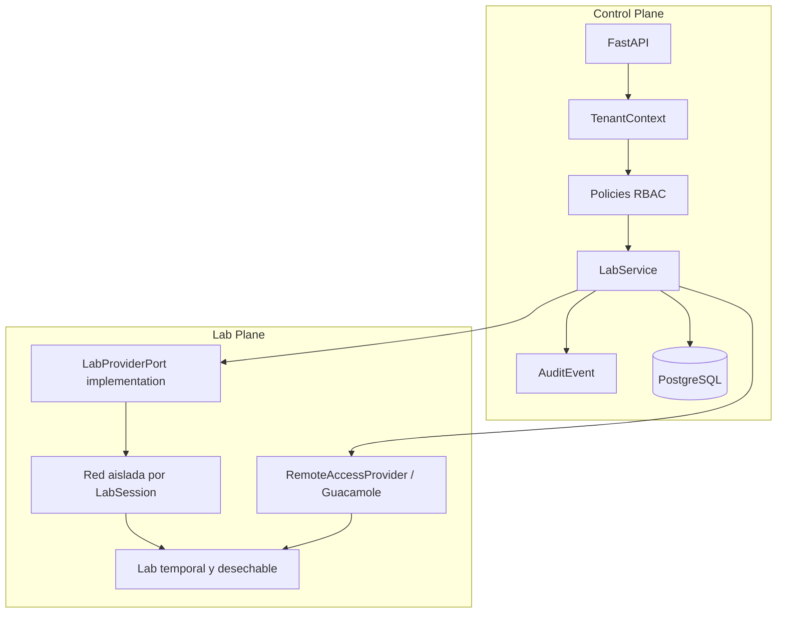

# DOC-BACK-ARCH-HEX-001-T03 — Reglas de dependencias, seguridad y multi-tenancy

**Estado:** fase documental. Pendiente de implantación en `BACK-ARCH-HEX-001`.

Este documento define reglas objetivo para que la futura arquitectura hexagonal pragmática del backend de Project Guakamole se aplique con enfoque **security-first**. No describe controles ya implementados ni sustituye una revisión de seguridad, QA o arquitectura.

## Alcance

- Define reglas documentales objetivo para seguridad, dependencias y multi-tenancy.
- No implementa controles todavía.
- Aplica a nuevos endpoints y a futuras refactorizaciones del backend.
- Debe guiar la fase futura `BACK-ARCH-HEX-001` y sus PRs asociados.
- No autoriza cambios de código productivo por sí mismo.

## Principio base security-first

La arquitectura hexagonal no sustituye los controles de seguridad. Ayuda a colocarlos en sitios consistentes, revisables y testeables.

Toda operación crítica del backend debe ser:

- **validada**, para impedir entradas inesperadas o peligrosas;
- **autorizada**, para evitar IDOR, Broken Access Control y escaladas de privilegios;
- **trazable**, mediante `AuditEvent` cuando aplique;
- **testeable**, con pruebas automatizadas de seguridad y multi-tenancy.

El objetivo no es añadir capas por estética, sino reducir riesgos reales de API en un producto multiempresa que gestionará usuarios, roles, escenarios, laboratorios, evidencias, informes y progreso.

## Threat model mínimo para API backend

La futura implantación deberá considerar, como mínimo, los siguientes riesgos:

| Riesgo | Descripción | Control documental esperado |
| --- | --- | --- |
| IDOR | Acceso a recursos cambiando identificadores. | `TenantContext`, policies y filtros por tenant en repositorios. |
| Broken Access Control | Usuario autenticado ejecuta acciones no permitidas. | RBAC centralizado en policies y tests negativos. |
| SQL injection | Entrada de usuario altera consultas. | SQLAlchemy parametrizado y allowlists. |
| Mass assignment | Payload modifica campos sensibles no previstos. | Schemas explícitos y rechazo de campos sensibles arbitrarios. |
| Exposición de datos sensibles | Se devuelven hashes, tokens, secretos o soluciones. | Output schemas explícitos y revisión de serialización. |
| Enumeración de recursos | La API revela existencia de recursos de otros tenants. | Estrategia 403/404 prudente. |
| Errores internos/stacktraces | Se exponen detalles de DB, proveedores o código. | Errores controlados y respuesta 500 genérica. |
| Cross-tenant data leak | Un tenant accede a datos de otro. | Resolución obligatoria de `TenantContext` y filtrado por organización. |
| Escalada de privilegios | Un usuario se concede roles o permisos. | Policies específicas y bloqueo de roles privilegiados desde APIs ordinarias. |
| Falta de auditoría | Acciones críticas no dejan rastro. | `AuditEvent` obligatorio en operaciones sensibles. |
| Abuso de `organization_id` | El cliente manipula organización en path/query/body. | Nunca confiar en `organization_id` sin validarlo contra identidad y membership. |

## Reglas de `TenantContext`

- Toda request autenticada multi-tenant debe resolverse dentro de un `TenantContext` antes de ejecutar casos de uso sensibles.
- El `TenantContext` se deriva de la identidad autenticada, la membership, los roles y la organización solicitada.
- Nunca se confía en `organization_id` recibido desde frontend, path, query o body sin validarlo contra la identidad autenticada.
- Si una operación acepta una organización en la URL, esa organización solo selecciona el contexto solicitado; no prueba autorización por sí misma.
- Una organización inactiva, deshabilitada o suspendida debe bloquear operaciones ordinarias.
- Un usuario inactivo, deshabilitado o bloqueado debe impedir operaciones autenticadas.
- `PLATFORM_ADMIN` es un caso especial: puede operar fuera de una organización concreta cuando el caso de uso lo requiera, pero debe quedar auditado y no debe mezclarse con APIs normales de administración de organización.
- Cualquier acceso cross-tenant autorizado por rol global debe ser explícito, revisable y auditable.

## Reglas RBAC y policies

- No deben existir permisos inline complejos dentro de routers.
- Las policies centralizan las decisiones de autorización.
- Los services deben invocar policies antes de acceder o modificar datos sensibles.
- Las policies reciben `TenantContext` y tipos de dominio; no deben depender de FastAPI.
- `COMPANY_ADMIN` queda limitado a su organización.
- `GROUP_MANAGER` requiere scope explícito por grupo y no debe asumir acceso global sobre todos los grupos de la organización.
- `EMPLOYEE` no puede administrar usuarios, roles, memberships ni permisos.
- `PLATFORM_ADMIN` no se asigna desde APIs de organización normales.
- Cualquier cambio de rol debe requerir policy específica y generar auditoría.
- Las decisiones de autorización deben ser testeables sin levantar servidor HTTP completo.

## Reglas de dependencias entre capas

Dependencias permitidas como objetivo:

```text
Router -> dependencies / schemas / services
Service -> policies / repositories / ports / audit
Policy -> TenantContext / tipos de dominio
Repository -> SQLAlchemy / models
Adapter externo -> ports / proveedor externo
```

Reglas concretas:

- `router` recibe HTTP, parámetros y dependencias; no concentra negocio ni permisos complejos.
- `service` orquesta casos de uso, policies, repositorios, puertos externos y auditoría.
- `policy` decide autorización sin conocer FastAPI, SQLAlchemy, Docker, Guacamole ni GitHub.
- `repository` encapsula consultas y persistencia con SQLAlchemy.
- `adapter` implementa un puerto para hablar con proveedores externos.
- Está prohibido `router -> SQLAlchemy` directo para casos de negocio.
- Está prohibido `router -> Docker`, `router -> Guacamole` o `router -> GitHub` directo.
- Las excepciones deberán justificarse en PR y revisarse arquitectónicamente.

## Reglas anti-SQL injection

- Usar SQLAlchemy ORM/Core parametrizado.
- No concatenar entrada de usuario en SQL.
- SQL raw solo por excepción justificada, parametrizada, revisada y testeada.
- Validar filtros, ordenaciones, paginación y límites con allowlists.
- No permitir que nombres de columnas, direcciones de ordenación o expresiones de búsqueda vengan sin normalización y validación.
- Definir límites máximos de paginación para evitar abusos de recursos.

## Reglas contra mass assignment

- Los schemas de entrada deben ser explícitos por caso de uso.
- No se deben reutilizar schemas internos o modelos ORM como payloads de escritura.
- No aceptar campos extra sensibles.
- No aceptar `roles`, `status`, `organization_id`, `permissions`, `is_admin` o equivalentes desde payload sin policy específica.
- Los cambios de rol, estado o permisos deben tener endpoints/casos de uso dedicados, auditables y revisados.
- El backend debe ignorar o rechazar intentos de establecer campos no permitidos, según la estrategia definida por el schema.

## Reglas de salida y datos sensibles

- Un modelo ORM no se devuelve directamente como respuesta HTTP.
- Las respuestas usan output schemas explícitos.
- Nunca se exponen `password_hash`, tokens, secretos, flags, respuestas correctas, credenciales temporales de labs ni configuración sensible.
- Las reglas de evaluación (`EvaluationRule`) no deben serializarse hacia clientes de alumno.
- Los errores deben ser controlados y no incluir stacktraces, trazas de SQL, detalles internos de proveedores, rutas locales o configuración sensible.
- Los responses deben revisarse como superficie de seguridad, no solo como formato funcional.

## Reglas de auditoría

Las acciones críticas deben generar `AuditEvent`.

Eventos mínimos previstos:

- `LOGIN_SUCCESS`
- `LOGIN_FAILED`
- `MFA_SUCCESS` / `MFA_FAILED`, si aplica
- `USER_CREATED`
- `USER_DISABLED`
- `ROLE_CHANGED`
- `GROUP_CREATED`
- `ROADMAP_ASSIGNED`
- `SCENARIO_STARTED`
- `ALERT_OPENED`
- `CASE_SUBMITTED`
- `LAB_REQUESTED`
- `LAB_STARTED`
- `LAB_EXTENDED`
- `LAB_DESTROYED`

Un `AuditEvent` debe incluir, cuando aplique:

- actor;
- `organization_id`;
- acción;
- entidad afectada;
- timestamp;
- `correlation_id`;
- IP y user agent si están disponibles.

No deben registrarse secretos, tokens, contraseñas, flags, respuestas correctas, credenciales temporales ni payloads sensibles completos en audit logs ni logs técnicos.

## Reglas para Labs y separación Control Plane / Lab Plane

- FastAPI no crea contenedores directamente.
- `LabService` usa un `LabProviderPort`.
- Guacamole actúa como `RemoteAccessProvider`, no como Lab Engine.
- Cada `LabSession` debe ser individual, temporal, aislada y desechable.
- El acceso directo a IPs internas de labs no debe exponerse a usuarios finales ni a Internet.
- Las credenciales temporales no se guardan en claro.
- La destrucción de laboratorios expirados no debe depender del navegador ni de JavaScript del cliente.
- Los errores de infraestructura deben poder invalidar o recuperar sesiones sin consumir indebidamente intentos cuando no haya sesión activa real.

## Reglas para Scenarios y contenidos

- GitHub es el **Content Source of Truth** para contenido no sensible: Markdown, documentación, assets, manifiestos y configuración no secreta.
- PostgreSQL es el **Operational Source of Truth** para usuarios, organizaciones, asignaciones, intentos, sesiones, informes, resultados y auditoría.
- `EvaluationRule`, flags, respuestas correctas y secretos no van a repositorios accesibles por alumnos.
- `ScenarioVersion` evita que cambios posteriores de contenido modifiquen intentos en curso.
- El backend debe tratar el contenido de escenarios como contenido versionado, no como fuente de autoridad para permisos o soluciones.

## Reglas de errores HTTP

| Código | Uso esperado |
| --- | --- |
| 400 | Payload o parámetros semánticamente inválidos cuando no aplique validación automática. |
| 401 | Usuario no autenticado o credenciales inválidas. |
| 403 | Usuario autenticado sin permiso, tenant denegado o scope insuficiente. |
| 404 | Recurso inexistente o no visible según estrategia anti-enumeración. |
| 409 | Conflicto de estado o transición no permitida. |
| 422 | Validación Pydantic de formato, tipos o restricciones declarativas. |
| 500 | Error interno genérico sin detalle sensible. |

Las respuestas de error deben ser coherentes y no revelar detalles internos de base de datos, proveedores, infraestructura ni stacktraces.

## Estrategia anti-enumeración

La API debe decidir de forma explícita cuándo devuelve `403` y cuándo `404`.

Recomendación prudente:

- Para recursos fuera del tenant del usuario, devolver `404` cuando revelar su existencia suponga riesgo de enumeración.
- Usar `403` cuando el usuario conoce legítimamente el recurso pero carece de permiso para una acción concreta dentro de su tenant.
- Permitir respuestas más explícitas solo para roles autorizados, como `PLATFORM_ADMIN`, y siempre con auditoría cuando proceda.
- No diferenciar mediante mensajes de error si un email, usuario, organización, grupo, roadmap o escenario existe cuando esa información facilite enumeración no autorizada.

## Checklist security-first para PRs futuros

- [ ] `TenantContext` validado.
- [ ] Policy invocada antes de acceder a datos sensibles.
- [ ] Inputs validados con schemas explícitos.
- [ ] Repositories filtran por tenant cuando aplica.
- [ ] Outputs revisados y sin secretos.
- [ ] Errores controlados y sin detalles internos.
- [ ] `AuditEvent` emitido si la acción es crítica.
- [ ] Tests de seguridad previstos o añadidos.
- [ ] No hay acceso directo desde router a SQLAlchemy o proveedores externos para negocio.
- [ ] No se aceptan campos sensibles por mass assignment.

## Tests futuros esperados para `BACK-ARCH-HEX-001`

La fase de implantación deberá prever pruebas automatizadas para, como mínimo:

- acceso cross-tenant denegado;
- `EMPLOYEE` no puede administrar usuarios;
- `COMPANY_ADMIN` no puede acceder a otra organización;
- `GROUP_MANAGER` no puede acceder a grupos fuera de su scope;
- `password_hash` no se expone en respuestas;
- payloads con apariencia de SQL injection no alteran consultas;
- intento de mass assignment ignorado o rechazado;
- auditoría emitida para acción crítica;
- usuario deshabilitado bloqueado;
- organización deshabilitada bloqueada.

## Flujo seguro de request multi-tenant



## Dependencias security-first por capas



## Control Plane / Lab Plane aplicado a seguridad



## Anti-patrones de seguridad

- Comprobar permisos con `if user.role == ...` dentro del router para casos complejos.
- Usar `organization_id` del payload como si fuera fiable.
- Consultar por `id` sin filtrar por tenant.
- Devolver modelos ORM completos.
- Incluir `password_hash`, tokens o configuración sensible en responses.
- Concatenar strings para construir SQL con entrada de usuario.
- Permitir que un payload defina roles, estado o permisos sin caso de uso específico.
- Crear contenedores Docker directamente desde un endpoint.
- Registrar secretos o credenciales temporales en logs.
- Exponer diferencias de error que permitan enumerar usuarios, organizaciones o recursos.
- Usar GitHub como fuente de verdad para soluciones, flags o reglas de evaluación sensibles.
- Mezclar lógica de Guacamole con creación real de laboratorios.

## Criterios de aceptación del documento

- Define reglas explícitas para `TenantContext`, RBAC, dependencies, SQL injection, mass assignment, salida de datos, auditoría, labs y escenarios.
- Incluye threat model mínimo de API backend.
- Incluye estrategia de errores HTTP y anti-enumeración.
- Incluye checklist security-first para PRs futuros.
- Incluye tests esperados para la fase `BACK-ARCH-HEX-001`.
- Incluye tres diagramas Mermaid: flujo multi-tenant, dependencias por capas y Control Plane / Lab Plane.
- No afirma que los controles estén ya implementados.
- No contiene secretos ni outputs de comandos.

## Relación con otros documentos y fases

- `architecture.md`: este documento concreta las implicaciones de seguridad de la arquitectura hexagonal pragmática descrita allí.
- `adr-backend-hexagonal-architecture.md`: desarrolla controles operativos derivados de la decisión arquitectónica.
- `module-structure.md`: complementa la estructura por módulos con reglas de dependencia y responsabilidades de seguridad.
- T04 testing strategy: deberá convertir estas reglas en estrategia de pruebas, fixtures y casos automatizados.
- T05 piloto IAM: deberá aplicar estas reglas en el primer piloto real de IAM/RBAC/multi-tenancy.
- `BACK-ARCH-HEX-001`: será la fase de implantación donde estas reglas deberán traducirse en código, tests, revisión arquitectónica y QA.
