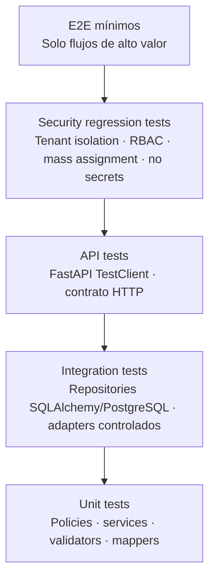
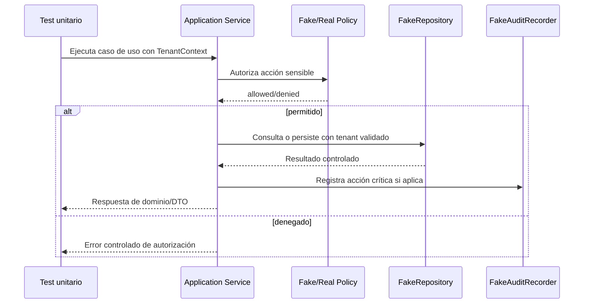
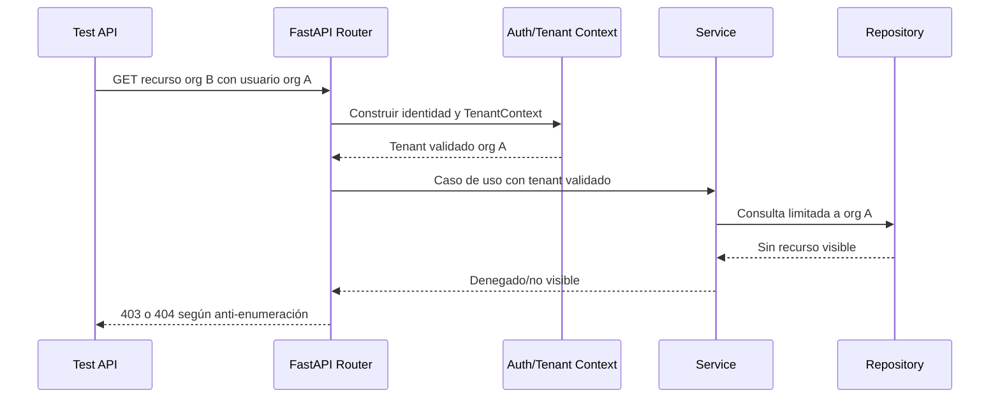

# DOC-BACK-ARCH-HEX-001-T04 — Estrategia de testing para arquitectura hexagonal

**Estado:** fase documental. Pendiente de implantación en `BACK-ARCH-HEX-001`.

Este documento define la estrategia de testing que deberá seguir la implantación futura de la arquitectura hexagonal pragmática y security-first del backend de Project Guakamole. No implementa tests Python ni afirma que ya existan.

## Alcance

- No implementa tests todavía.
- Define estrategia, tipos de tests, naming, responsabilidades y criterios QA.
- Aplica a la futura implementación hexagonal y al piloto IAM previsto en T05.
- Convierte las reglas definidas en T00-T03 en tipos de pruebas concretas.
- Sirve como guía para `python-implementer` y `qa-tester` durante `BACK-ARCH-HEX-001`.

## Principios de testing

- **Security-first:** las pruebas negativas de seguridad son obligatorias, no complementarias.
- Las reglas de negocio deben probarse fuera de FastAPI siempre que sea posible.
- Los `services` y `policies` deben tener tests rápidos con fakes controlados.
- Los `repositories` y adapters deben probarse de forma aislada respecto a la lógica de negocio.
- Los tests API deben validar el contrato HTTP, autenticación, autorización y errores.
- Los tests multi-tenant son un requisito de seguridad, no una mejora opcional.
- La seguridad backend no debe depender del frontend.

## Pirámide de tests recomendada



### Unit tests

Aplican a `policies`, `services`, validadores y mappers si existen. Deben ser rápidos, deterministas y sin dependencia de base de datos, red, Docker, Guacamole o GitHub.

### Integration tests

Aplican a repositories SQLAlchemy/PostgreSQL y adapters controlados. Deben validar consultas reales, límites, filtros por tenant y comportamiento ante payloads maliciosos.

### API tests

Aplican a routers FastAPI mediante `TestClient` o herramienta equivalente. Deben validar contrato HTTP, códigos de estado, schemas de salida y que no se expone información interna.

### Security regression tests

Cubren tenant isolation, RBAC, mass assignment, ausencia de secretos, flags o respuestas correctas, y regresiones de autorización.

### E2E mínimos

Solo deben añadirse cuando aporten valor claro y no sustituyan las pruebas unitarias, de integración, API y seguridad.

## Tests de policies

La futura implementación debe cubrir, como mínimo:

- `COMPANY_ADMIN` accede a recursos de su propia organización: permitido.
- `COMPANY_ADMIN` accede a otra organización: denegado.
- `EMPLOYEE` intenta una acción administrativa: denegado.
- `GROUP_MANAGER` intenta operar fuera de su scope: denegado.
- `PLATFORM_ADMIN` usa un caso especial: permitido solo si queda auditado.
- Usuario deshabilitado u organización deshabilitada: denegado.

## Tests de services con fake repositories

Los services deben probarse con fakes para aislar reglas de negocio:

- El service invoca la policy antes del repository en casos sensibles.
- El service no depende de `FastAPI Request`.
- El service orquesta `AuditEvent` cuando ejecuta una acción crítica.
- El service maneja errores controlados y no propaga detalles internos innecesarios.



## Tests de repositories

Los repositories deberán demostrar que:

- Todas las queries sensibles filtran por `organization_id` validado.
- No devuelven datos cross-tenant.
- La paginación y los límites funcionan y evitan respuestas no acotadas.
- La ordenación solo admite campos en allowlist.
- Payloads tipo SQL injection en búsquedas o filtros no alteran la consulta ni amplían visibilidad.

## Tests de schemas Pydantic

Debe probarse:

- Inputs válidos e inválidos.
- Rechazo o ignorancia controlada de campos extra según la configuración elegida.
- Mass assignment: no aceptar arbitrariamente `roles`, `status`, `permissions`, `is_admin` u `organization_id`.
- Output schemas no exponen `password_hash`, tokens, secretos, flags ni respuestas correctas.

## Tests API

Los endpoints futuros deben cubrir:

- `401` para usuario no autenticado.
- `403` para usuario autenticado sin permiso.
- `404` para recurso inexistente o no visible, según estrategia anti-enumeración.
- `409` para conflicto de estado.
- `422` para validación de entrada.
- `500` sin stacktrace ni detalles internos en la respuesta.



## Tests de auditoría

Las acciones críticas deben emitir `AuditEvent` verificable:

- Contiene actor.
- Contiene `organization_id` cuando aplique.
- Contiene `action`, entidad, timestamp y `correlation_id`.
- No registra secretos ni payloads sensibles completos.

## Tests de Labs futuros

Cuando se implemente el área de Labs, deberá probarse que:

- FastAPI/router no llama Docker directamente.
- `LabService` usa `LabProviderPort`.
- Una `LabSession` expirada se destruye mediante reaper/worker, no por el navegador.
- Las credenciales temporales no se exponen ni se guardan en claro.
- Los estados de `LabSession` transicionan de forma controlada.

## Tests de Scenarios futuros

La implementación futura de escenarios deberá validar que:

- `EvaluationRule`, flags y respuestas correctas no se exponen al alumno.
- `ScenarioVersion` fija el contenido utilizado por cada intento.
- El contenido de GitHub no decide permisos ni resultados operativos.

## Tests específicos del piloto IAM futuro

Endpoint previsto: `GET /api/v1/iam/organizations/{organization_id}/users`.

Tests esperados:

- `platform admin can list any org users`.
- `company admin can list own org users`.
- `company admin cannot list other org users`.
- `employee cannot list users`.
- `group manager behavior explicitly denied or scoped according to policy`.
- `disabled user denied`.
- `disabled organization denied`.
- La respuesta no expone `password_hash`.
- Organización desconocida o cross-tenant devuelve `403` o `404` según la estrategia anti-enumeración.
- El repository se invoca solo con tenant validado.
- Payloads de búsqueda tipo SQL injection son seguros.
- Campos de mass assignment se ignoran o rechazan si el endpoint soporta filtros por query/body.

## Naming y organización futura de tests

No se crean archivos en esta task documental. En fase de implementación se recomiendan rutas bajo `backend/tests/`, por ejemplo:

```text
backend/tests/unit/iam/test_iam_user_policy.py
backend/tests/unit/iam/test_iam_user_service.py
backend/tests/integration/iam/test_iam_user_repository.py
backend/tests/api/iam/test_iam_user_api.py
backend/tests/architecture/test_hexagonal_boundaries.py
```

## Fixtures y fakes recomendados

- `FakeUserRepository`.
- `FakeAuditRecorder`.
- Builders de `TenantContext`.
- Factorías de usuarios y roles.
- Factorías de organizaciones.
- No usar datos reales ni secretos.

## Tests de límites arquitectónicos

Opcional, pero recomendado mediante tests estáticos o checks simples:

- Un router no importa Docker, Guacamole ni SDK de GitHub.
- Un router no usa `SQLAlchemy Session` para lógica de negocio.
- Los models no importan routers ni services.
- Las dependencias apuntan hacia el dominio/aplicación y no al revés.

## Comandos esperados en fase de implementación

Estos comandos no se ejecutan en esta task documental. Deberán usarse durante `BACK-ARCH-HEX-001` cuando exista código y tests:

```bash
make backend-check
uv run ruff check .
uv run ruff format --check .
uv run mypy --strict .
uv run pytest
make db-upgrade
```

`make db-upgrade` solo aplica cuando haya migraciones.

## Criterios mínimos QA para aceptar la implementación futura

- Tests unitarios de policies y services.
- Tests de repository si hay queries nuevas.
- Tests API si hay endpoints nuevos.
- Tests negativos de seguridad.
- Sin secretos en outputs, logs ni auditoría.
- Cobertura explícita de aislamiento multi-tenant.
- Errores controlados y sin exposición de stacktraces.
- Revisión QA de casos permitidos y denegados.

## Anti-patrones de testing

- Probar solo `200 OK`.
- No probar `cross-tenant denied`.
- Depender del frontend para validar seguridad.
- Usar datos reales o secretos.
- Verificar implementación interna frágil en vez de comportamiento observable.
- Mockear todo hasta dejar de probar seguridad real.

## Criterios de aceptación del documento

- Explica la estrategia de testing sin implementar tests.
- Traduce T00-T03 a pruebas unitarias, integración, API y seguridad.
- Incluye el piloto IAM futuro y sus casos obligatorios.
- Define naming, organización, fixtures y fakes recomendados.
- Incluye criterios QA mínimos para `BACK-ARCH-HEX-001`.
- Incluye diagramas Mermaid de pirámide, service test y API multi-tenant.
- No contiene secretos ni resultados inventados de comandos.

## Relación con otros documentos y fases

- `architecture.md`: esta estrategia valida que la arquitectura hexagonal se pueda probar por capas.
- `adr-backend-hexagonal-architecture.md`: aporta criterios QA para confirmar la decisión arquitectónica.
- `module-structure.md`: alinea la organización de tests con la estructura modular futura.
- `security-and-tenant-rules.md`: convierte reglas de seguridad y tenant isolation en regresiones obligatorias.
- T05 piloto IAM: define los tests esperados para el primer piloto.
- T06 roadmap de implantación: deberá incorporar estos criterios como gates de aceptación.
- `BACK-ARCH-HEX-001`: fase futura responsable de implementar código y tests siguiendo esta guía.
