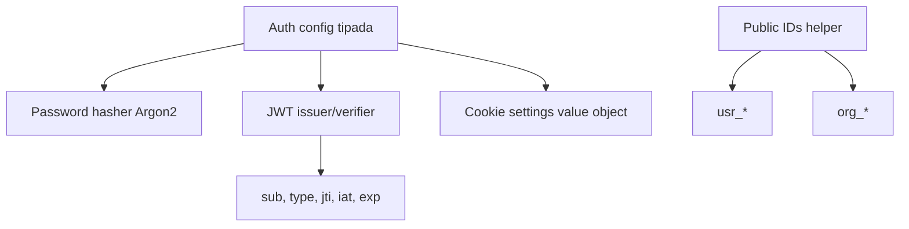
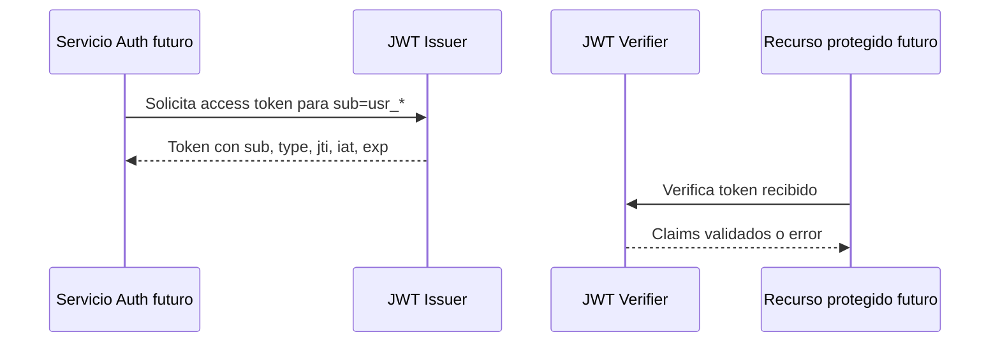

# BACK-AUTH-OAUTH2-001 — Implementación y validación OAuth2

**Estado:** Pendiente de implementación  
**Ámbito:** `backend/`  
**Carpeta:** `docs/backend/oauth2/`

## 1. Resumen de cambios

Pendiente de implementación.

## 2. Archivos modificados

Pendiente de implementación.

## 3. Endpoints añadidos

Pendiente de implementación.

## 4. Configuración añadida

Pendiente de implementación.

## 5. Tests añadidos

Pendiente de implementación.

## 6. Validaciones ejecutadas

Pendiente de implementación.

## 7. Resultado QA

Pendiente de implementación.

## 8. Riesgos pendientes

Pendiente de implementación.

## 9. Notas para la fase JWT

Pendiente de implementación.

## 10. Estado final

Pendiente de implementación.

---

# BACK-AUTH-OAUTH2-002 — Auth Core

**Estado:** QA aprobado  
**Ámbito:** `backend/`  
**Tipo de cambio:** Núcleo de autenticación sin endpoints ni routers

## 1. Resumen de cambios

Se ha incorporado el núcleo base de autenticación para el backend, dejando preparadas las piezas reutilizables que necesitarán las fases posteriores de login, emisión de sesiones, autorización y protección de rutas.

El alcance de esta tarea se limita a componentes de dominio/infraestructura de autenticación. No se han implementado endpoints HTTP, routers, flujos de login/register, CORS ni protección CSRF.

## 2. Componentes añadidos



- Configuración de autenticación tipada.
- Hashing y verificación de contraseñas con `pwdlib[argon2]`.
- Emisor/verificador JWT mínimo para tokens de acceso.
- Value object para settings de cookies.
- Helper para identificadores públicos con prefijos `usr_` y `org_`.
- Tests unitarios para el comportamiento del Auth Core.

## 3. Archivos modificados

- `.env.example`
- `backend/pyproject.toml`
- `backend/uv.lock`
- `backend/app/domain/auth/__init__.py`
- `backend/app/domain/auth/config.py`
- `backend/app/domain/auth/cookies.py`
- `backend/app/domain/auth/password_hasher.py`
- `backend/app/domain/auth/public_ids.py`
- `backend/app/domain/auth/tokens.py`
- `backend/tests/unit/test_auth_core.py`

## 4. Endpoints añadidos

No se han añadido endpoints ni routers en esta tarea.

## 5. Ejemplos de contrato interno

### Claims JWT esperados

Ejemplo orientativo de payload esperado para un access token, sin incluir secretos ni token real:

```json
{
  "sub": "usr_01HZXAMPLEUSERID0000000000",
  "type": "access",
  "jti": "01HZXAMPLETOKENID0000000000",
  "iat": 1760000000,
  "exp": 1760000900
}
```

### Cookie settings

Ejemplo de configuración serializable del value object de cookies:

```json
{
  "httponly": true,
  "secure": true,
  "samesite": "lax",
  "path": "/"
}
```

### Public IDs

Ejemplos de formato esperado:

```text
usr_01HZXAMPLEUSERID0000000000
org_01HZXAMPLEORGID00000000000
```

## 6. Secuencia de emisión y verificación JWT



La secuencia muestra el contrato técnico del core, no endpoints implementados en esta tarea.

## 7. Tests añadidos

Se han añadido tests unitarios en:

- `backend/tests/unit/test_auth_core.py`

Los tests cubren el comportamiento base del hashing de contraseñas, tokens, configuración, cookies e identificadores públicos según el alcance indicado por la implementación.

## 8. Validaciones ejecutadas

- `make backend-quality` ✅
- `make backend-test-unit` ✅ (`291 passed, 56 deselected`)

## 9. Resultado QA

QA aprobado según las validaciones indicadas.

## 10. Riesgos pendientes

- Todavía no existen endpoints de autenticación, login, register ni refresh.
- La integración con RBAC, tenant context y auditoría queda pendiente para tareas posteriores.
- Las cookies están modeladas como configuración/value object, pero no se ha documentado uso en respuestas HTTP porque no forma parte de esta task.
- Debe revisarse la política definitiva de rotación de secretos, expiración y revocación cuando se implementen sesiones reales.

## 11. Impacto backend

Este cambio establece las bases internas de autenticación del backend. Reduce acoplamiento futuro al separar configuración, hashing, emisión/verificación de tokens, cookies e identificadores públicos antes de exponer flujos HTTP. También prepara el terreno para aplicar seguridad server-side sin colocar lógica crítica en frontend.
